# kubernetes-tutorial

In this tutorial we will install 2 VM Images. One will server as the Kubernetes master, and the other a Kubernetes Worker Node. We'll configure Docker and Kubernetes on both Images. 

## Install the Master and Node 

Note: when configuing the image with VirtualBox or VMWare Fusion, it is recommended to set up a second network, and assign stattic IP addressed - e.g. 172.31.x.x. However, in this example, we're are going to just use a single NAT network, which simplifies the configuration and works well.

### Download and setup CentOS 7
 - Download the DVD ISO from [CentOS Download Center](https://www.centos.org/download/)

 - Create a `kmaster` and `knode1`

 - The following screenshots will show an example of configuring the Master node using VMWare Fusion. After creating the Master Node, you can follow the same pattern to create the Worker Node.

 - Create a new virtual image 

     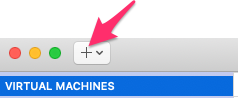

- Drag and drop the CentOS ISO  on the install dialog, and then select that ISO

     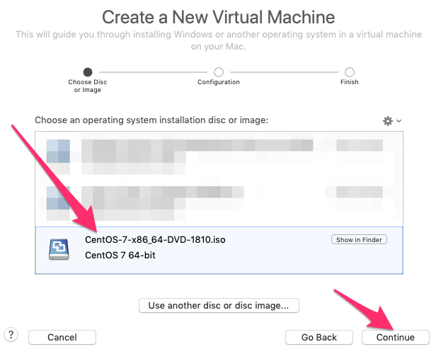

- Continue

     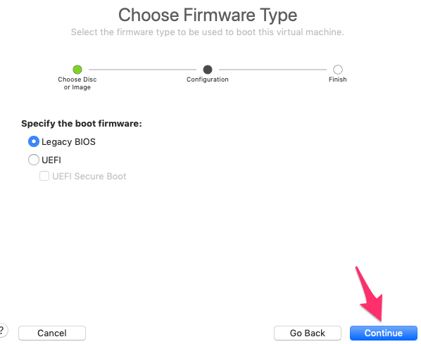

- Select the **Customize Settings** option

     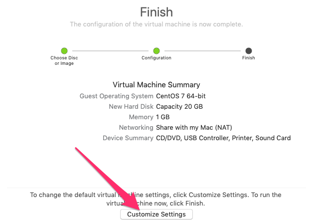

- Save the virtual machine as `kmaster.vmwarevm`

     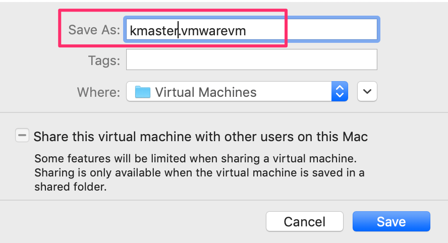

- Select **Processors & Memory**

     

- Set the Processors to **2 processor cores** and increase the memory. Since my host has plent of RAM, I increased the setting to **4+GB**, but you can use slightly less

     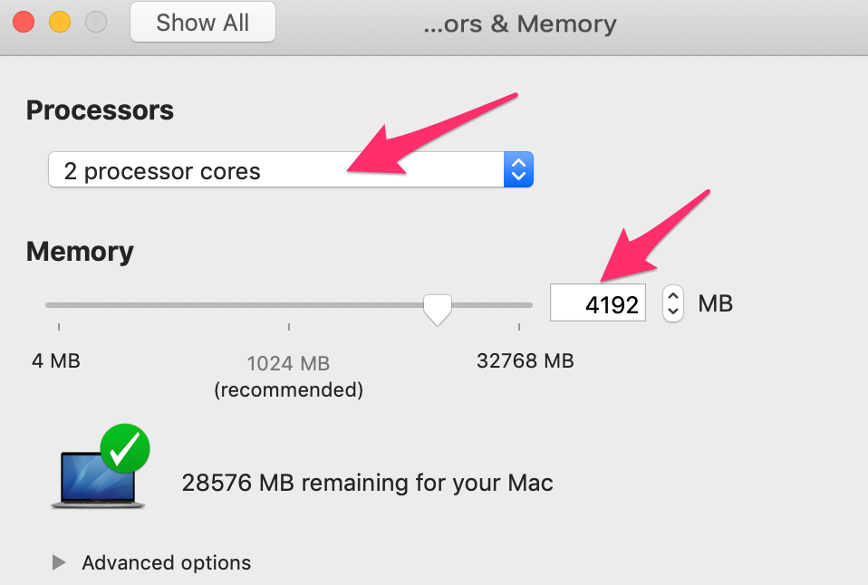

- Increase the amount of diskspace to aproximately 30GB

     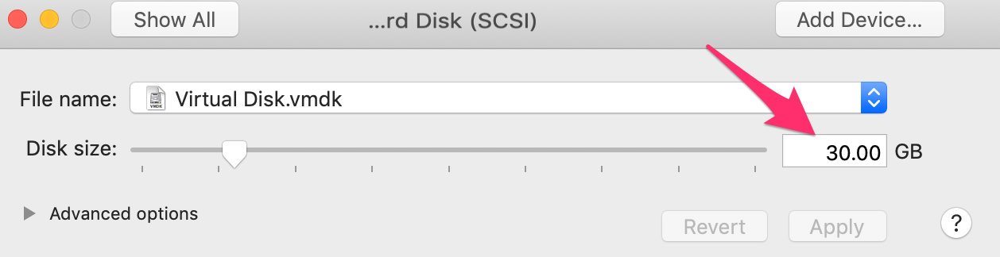

- Press enter to start the install

     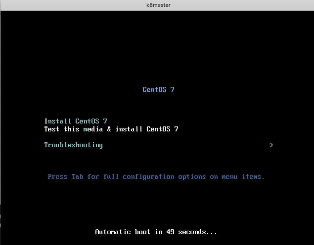

- Set the language

     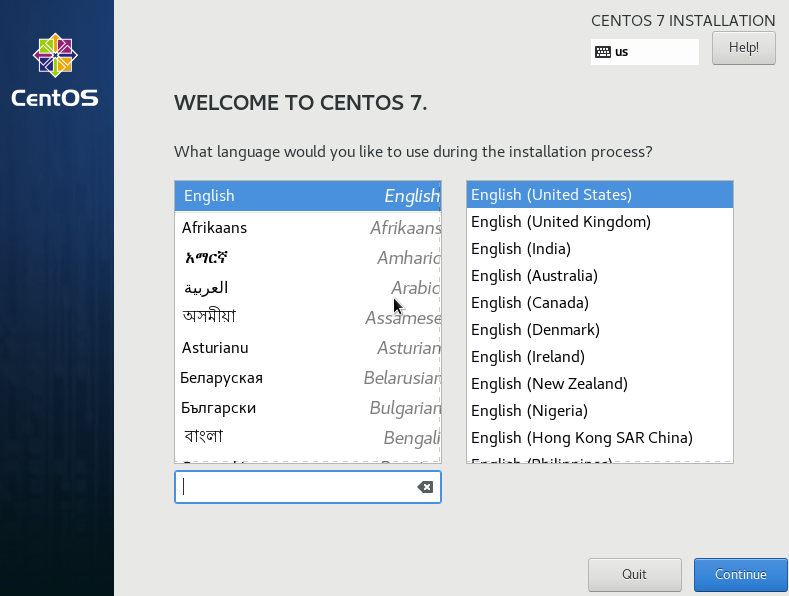

- Click on Sofware Selection

     

- Choose **Gnome** and **System and Administration Tools**

     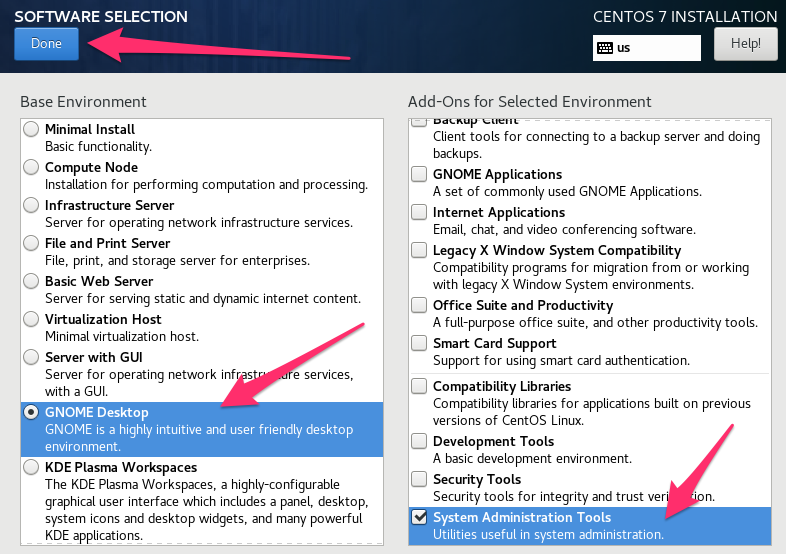

- Select the Installation desitnation

     

- Click on Done

     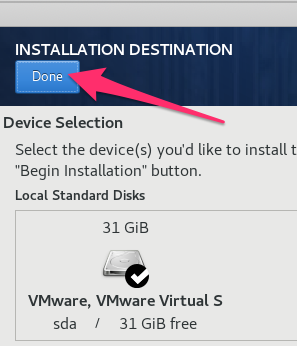

- Select the **Network and Host Name**

     

- Ensure that the connection is **ON** and set the **Host Name** to `kmaster`

     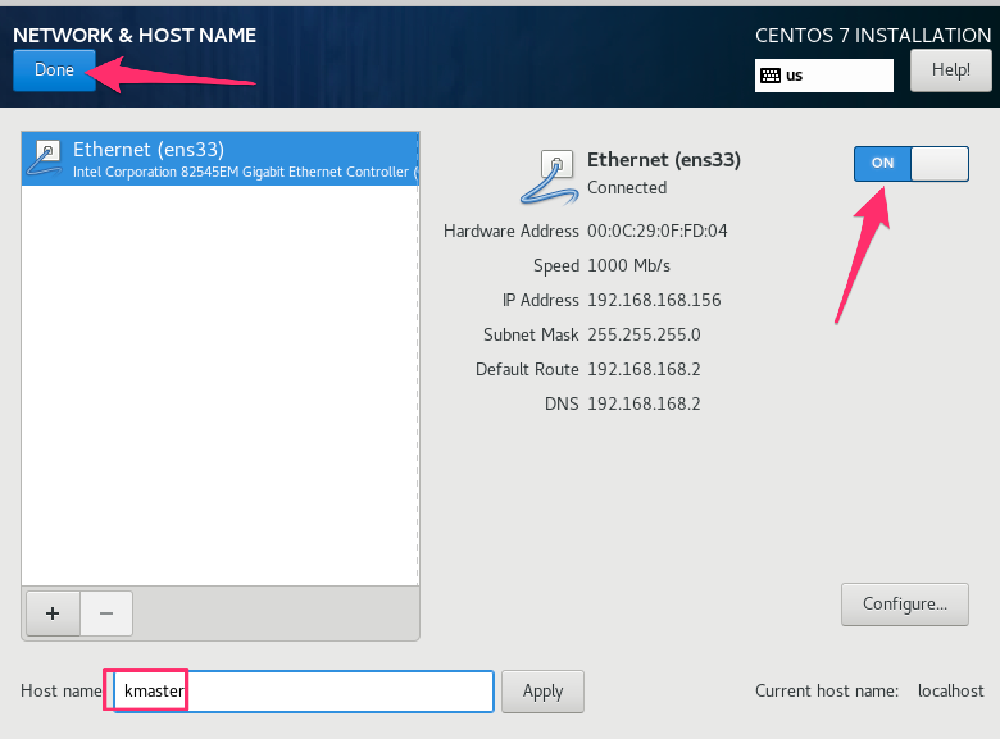

- Click on **Begin Installation**

     

- Click on **Root Password**

     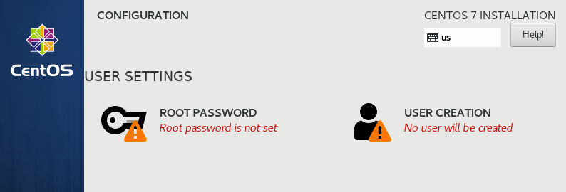

- Set the Root Password

     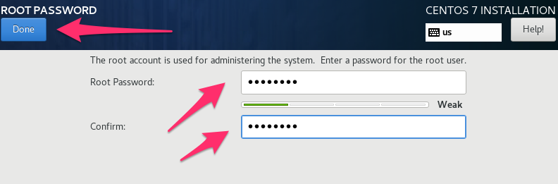

- Select the Create User option

- Create a username and password. I also made this user an **administrator**

     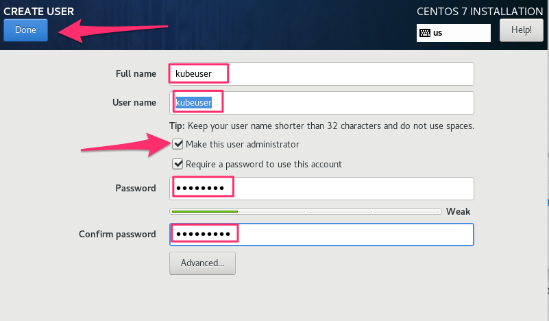

- Click on  **License Information**

     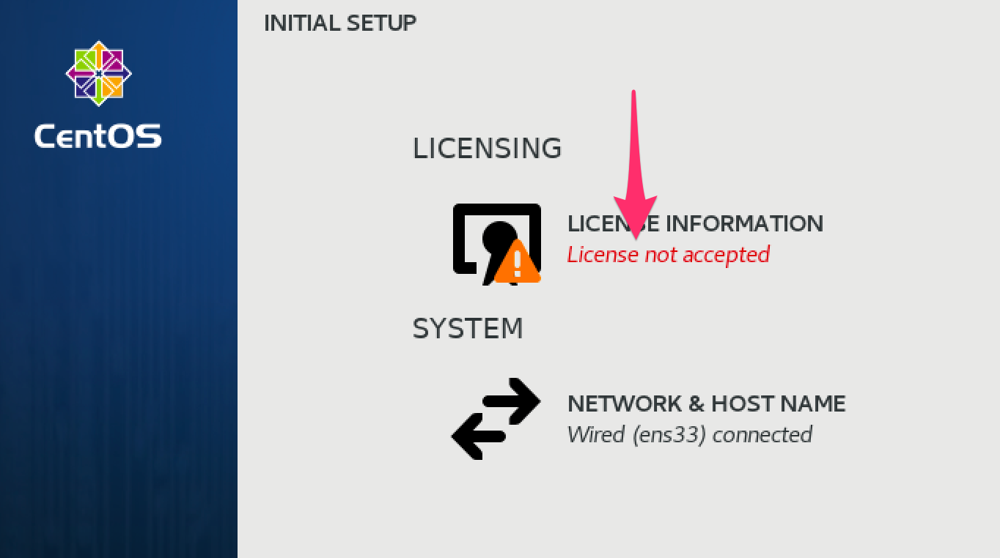

- Click on **Finish Configuration**

     

 - Start a terminal window by right clicking on the **Desktop**. Once a terminal windows is open, enter the following command

 - `$ sudo su`

 - You should not be at a **#** Prompt

 - If the hostnames have not been set correctly, you can us the following commands to set the Master and node to:`kmaster` and `knode1` 
 
    ```
    hostnamectl set-hostname kmaster
    ``` 

- Turn off Swap

    Run commands as `sudo su` at the **#** prompt
    ```
    setenforce 0

    sed -i --follow-symlinks 's/SELINUX=enforcing/SELINUX=disabled/g' /etc/sysconfig/selinux

    swapoff -a
    ```

- Comment out the swap in fstab 

    Run commands as `sudo su` at the **#** prompt

    ```
    vi /etc/fstab
    ```

    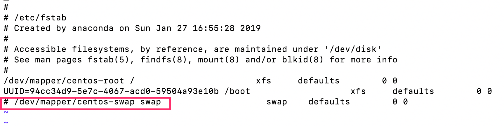

- Make sure your network connect is on - use **Network Setting console**

    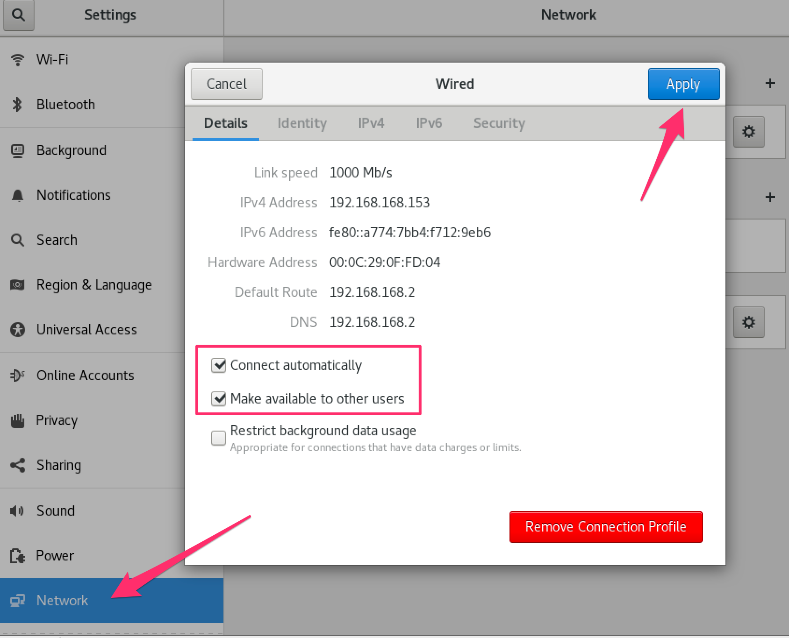

- Turn off the firewall

    Run commands as `sudo su` at the **#** prompt
    ```
    systemctl stop firewalld
    systemctl disable firewalld
    ```

- Allow Bridge/internet access over nat

    Run commands as `sudo su` at the **#** prompt
    ```
    modprobe br_netfilter
 
    echo '1' > /proc/sys/net/bridge/bridge-nf-call-iptables

    cat /proc/sys/net/bridge/bridge-nf-call-iptables
    ```

- Make permanent but editing sysctl.conf and causing br_netfilter to load

    Run commands as `sudo su` at the **#** prompt
    ```
    echo 'br_netfilter' > /etc/modules-load.d/br_netfilter.conf
 
    cat <<EOF >> /etc/sysctl.conf
    net.bridge.bridge-nf-call-ip6tables = 1
    net.bridge.bridge-nf-call-iptables = 1
    EOF
    ```

-   It's recommended to reboot the kmaster to knode1 images. Make sure all setting have taken effect after rebooting

- Once restarted, connect back into the image(s) and edit the host files in both images

    Run commands as `sudo su` at the **#** prompt
    ```
    vi /etc/hosts
    ```

    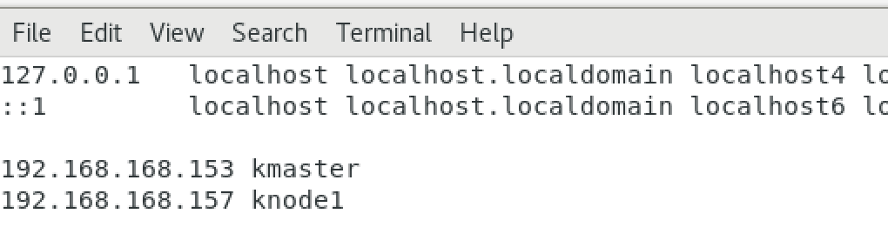
 
- Setup yum to install kubernetes - Note, you will run the following commands at the **#** prompt until instructed otherwise:

    ```
    cat <<EOF > /etc/yum.repos.d/kubernetes.repo
    [kubernetes]
    name=Kubernetes
    baseurl=https://packages.cloud.google.com/yum/repos/kubernetes-el7-x86_64
    enabled=1
    gpgcheck=1
    repo_gpgcheck=1
    gpgkey=https://packages.cloud.google.com/yum/doc/yum-key.gpg
        https://packages.cloud.google.com/yum/doc/rpm-package-key.gpg
    EOF

    ```

- Run yum to install kubernetes and docker:

    ```
    yum install -y kubelet kubeadm kubectl docker -y
    ```

- Update the kubernetes config file:

    ```
    sed -i 's/cgroup-driver=systemd/cgroup-driver=cgroupfs/g' /etc/systemd/system/kubelet.service.d/10-kubeadm.conf
    ```

- Enable docker and kubernetes

    ```
    systemctl enable docker && systemctl enable kubelet
    systemctl start docker && systemctl start kubelet
    ```

- ***Reboot*** the image(s)

### **Master only** install

- Setup Kubernetes - Run the commands as `sudo su` at the **#** prompt

    ```
    kubeadm init --pod-network-cidr=10.244.0.0/16 --apiserver-advertise-address=REPLACE-WITH-YOUR-IP-ADDRESS
    ```

- **Copy the Join** command and store it locally. This command will be used later when joining the node to the master. **It's important to not lose this command**.

    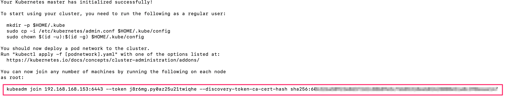

- Exit the **sudo** user to the **$** 

    If connected as `sudo`, exit to the **$** prompt
    ```
    exit

    $  # you shoud be here....
    ```

    Run commands as `kubeuser` at the **$** prompt
    ```
    mkdir -p $HOME/.kube
    sudo cp -i /etc/kubernetes/admin.conf $HOME/.kube/config
    sudo chown $(id -u):$(id -g) $HOME/.kube/config
    ```

- Wait for all Pods to show running, with the exception of the **coredns** pods which will change to running later when the flannel network is configured. 

    Run commands as `kubeuser` at the **$** prompt
    ```
    kubectl get pods -o wide --all-namespaces
    ```

    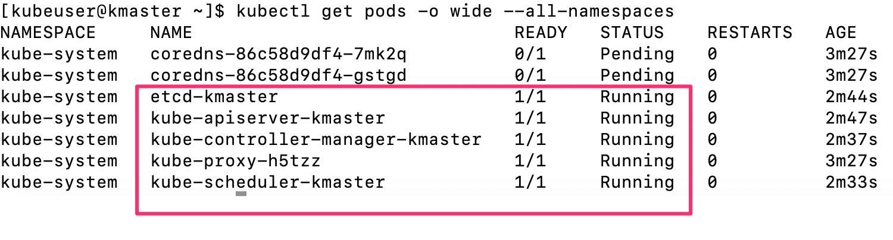

- Continue with the [KubeNetConfig.md](./KubeNetConfig.md) documentation to complete the Kubernetes install.


