# Demos

## Booking Application

Find info about the Booking Application at the [Istio.or Website](https://preliminary.istio.io/docs/examples/bookinfo/)

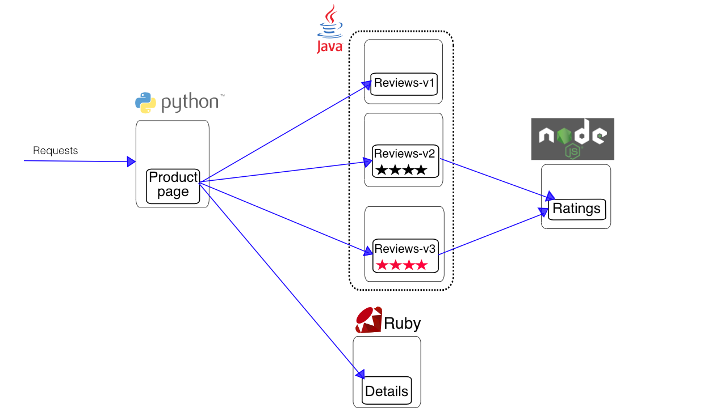


### 01 - Deploy the Booking Application

### Detail Service and Deployment:

```yaml
##################################################################################################
# Details service
##################################################################################################
apiVersion: v1
kind: Service
metadata:
  name: details
  labels:
    app: details
spec:
  ports:
  - port: 9080
    name: http
  selector:
    app: details
---
apiVersion: extensions/v1beta1
kind: Deployment
metadata:
  name: details-v1
spec:
  replicas: 1
  template:
    metadata:
      labels:
        app: details
        version: v1
    spec:
      containers:
      - name: details
        image: istio/examples-bookinfo-details-v1:1.8.0
        imagePullPolicy: IfNotPresent
        ports:
        - containerPort: 9080
---
```

### Rating Service and Deployment

```yaml
##################################################################################################
# Ratings service
##################################################################################################
apiVersion: v1
kind: Service
metadata:
  name: ratings
  labels:
    app: ratings
spec:
  ports:
  - port: 9080
    name: http
  selector:
    app: ratings
---
apiVersion: extensions/v1beta1
kind: Deployment
metadata:
  name: ratings-v1
spec:
  replicas: 1
  template:
    metadata:
      labels:
        app: ratings
        version: v1
    spec:
      containers:
      - name: ratings
        image: istio/examples-bookinfo-ratings-v1:1.8.0
        imagePullPolicy: IfNotPresent
        ports:
        - containerPort: 9080
---
```

### Review Service and Deployment

```yaml
##################################################################################################
# Reviews service
##################################################################################################
apiVersion: v1
kind: Service
metadata:
  name: reviews
  labels:
    app: reviews
spec:
  ports:
  - port: 9080
    name: http
  selector:
    app: reviews
---
apiVersion: extensions/v1beta1
kind: Deployment
metadata:
  name: reviews-v1
spec:
  replicas: 1
  template:
    metadata:
      labels:
        app: reviews
        version: v1
    spec:
      containers:
      - name: reviews
        image: istio/examples-bookinfo-reviews-v1:1.8.0
        imagePullPolicy: IfNotPresent
        ports:
        - containerPort: 9080
---
apiVersion: extensions/v1beta1
kind: Deployment
metadata:
  name: reviews-v2
spec:
  replicas: 1
  template:
    metadata:
      labels:
        app: reviews
        version: v2
    spec:
      containers:
      - name: reviews
        image: istio/examples-bookinfo-reviews-v2:1.8.0
        imagePullPolicy: IfNotPresent
        ports:
        - containerPort: 9080
---
apiVersion: extensions/v1beta1
kind: Deployment
metadata:
  name: reviews-v3
spec:
  replicas: 1
  template:
    metadata:
      labels:
        app: reviews
        version: v3
    spec:
      containers:
      - name: reviews
        image: istio/examples-bookinfo-reviews-v3:1.8.0
        imagePullPolicy: IfNotPresent
        ports:
        - containerPort: 9080
---
```

### Product Service and Deployment

```yaml
##################################################################################################
# Productpage services
##################################################################################################
apiVersion: v1
kind: Service
metadata:
  name: productpage
  labels:
    app: productpage
spec:
  ports:
  - port: 9080
    name: http
  selector:
    app: productpage
---
apiVersion: extensions/v1beta1
kind: Deployment
metadata:
  name: productpage-v1
spec:
  replicas: 1
  template:
    metadata:
      labels:
        app: productpage
        version: v1
    spec:
      containers:
      - name: productpage
        image: istio/examples-bookinfo-productpage-v1:1.8.0
        imagePullPolicy: IfNotPresent
        ports:
        - containerPort: 9080
---
```

### Add the Gateway and Virtual Service

```yaml
apiVersion: networking.istio.io/v1alpha3
kind: Gateway
metadata:
  name: bookinfo-gateway
spec:
  selector:
    istio: ingressgateway # use istio default controller
  servers:
  - port:
      number: 80
      name: http
      protocol: HTTP
    hosts:
    - "*"
---
apiVersion: networking.istio.io/v1alpha3
kind: VirtualService
metadata:
  name: bookinfo
spec:
  hosts:
  - "*"
  gateways:
  - bookinfo-gateway
  http:
  - match:
    - uri:
        exact: /productpage
    - uri:
        exact: /login
    - uri:
        exact: /logout
    - uri:
        prefix: /api/v1/products
    route:
    - destination:
        host: productpage
        port:
          number: 9080
```

### Add the Destination Rules

```yaml
apiVersion: networking.istio.io/v1alpha3
kind: DestinationRule
metadata:
  name: productpage
spec:
  host: productpage
  trafficPolicy:
    tls:
      mode: ISTIO_MUTUAL
  subsets:
  - name: v1
    labels:
      version: v1
---
apiVersion: networking.istio.io/v1alpha3
kind: DestinationRule
metadata:
  name: reviews
spec:
  host: reviews
  trafficPolicy:
    tls:
      mode: ISTIO_MUTUAL
  subsets:
  - name: v1
    labels:
      version: v1
  - name: v2
    labels:
      version: v2
  - name: v3
    labels:
      version: v3
---
apiVersion: networking.istio.io/v1alpha3
kind: DestinationRule
metadata:
  name: ratings
spec:
  host: ratings
  trafficPolicy:
    tls:
      mode: ISTIO_MUTUAL
  subsets:
  - name: v1
    labels:
      version: v1
  - name: v2
    labels:
      version: v2
  - name: v2-mysql
    labels:
      version: v2-mysql
  - name: v2-mysql-vm
    labels:
      version: v2-mysql-vm
---
apiVersion: networking.istio.io/v1alpha3
kind: DestinationRule
metadata:
  name: details
spec:
  host: details
  trafficPolicy:
    tls:
      mode: ISTIO_MUTUAL
  subsets:
  - name: v1
    labels:
      version: v1
  - name: v2
    labels:
      version: v2
---
```

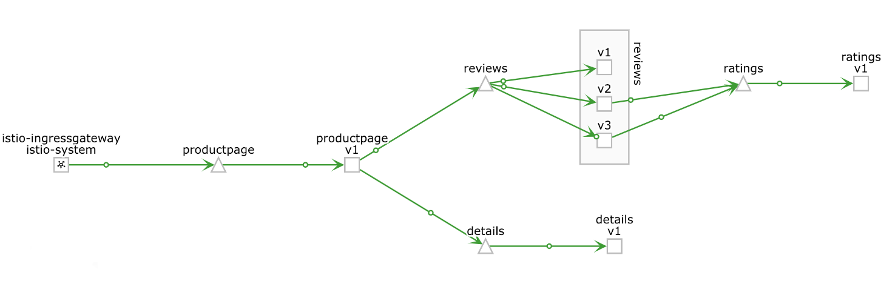


### 02 - Route to Reviews Version 1

```yaml
apiVersion: networking.istio.io/v1alpha3
kind: VirtualService
metadata:
  name: productpage
spec:
  hosts:
  - productpage
  http:
  - route:
    - destination:
        host: productpage
        subset: v1
---
apiVersion: networking.istio.io/v1alpha3
kind: VirtualService
metadata:
  name: reviews
spec:
  hosts:
  - reviews
  http:
  - route:
    - destination:
        host: reviews
        subset: v1
---
apiVersion: networking.istio.io/v1alpha3
kind: VirtualService
metadata:
  name: ratings
spec:
  hosts:
  - ratings
  http:
  - route:
    - destination:
        host: ratings
        subset: v1
---
apiVersion: networking.istio.io/v1alpha3
kind: VirtualService
metadata:
  name: details
spec:
  hosts:
  - details
  http:
  - route:
    - destination:
        host: details
        subset: v1
```


### 03 - Shift Traffic 50/50 to Reviews V1 and V3

```yaml
apiVersion: networking.istio.io/v1alpha3
kind: VirtualService
metadata:
  name: reviews
spec:
  hosts:
    - reviews
  http:
  - route:
    - destination:
        host: reviews
        subset: v1
      weight: 50
    - destination:
        host: reviews
        subset: v3
      weight: 50
```

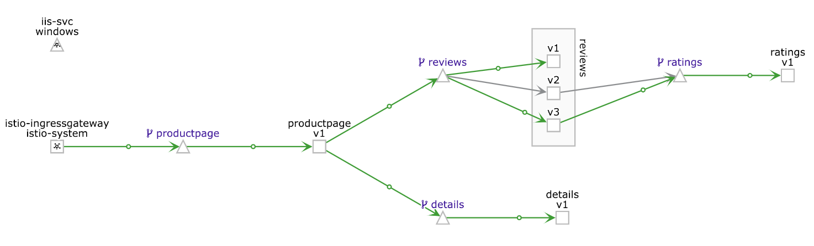

### 04.1 - Shift All Traffic to Reviews V3

```yaml
apiVersion: networking.istio.io/v1alpha3
kind: VirtualService
metadata:
  name: reviews
spec:
  hosts:
    - reviews
  http:
  - route:
    - destination:
        host: reviews
        subset: v3

```

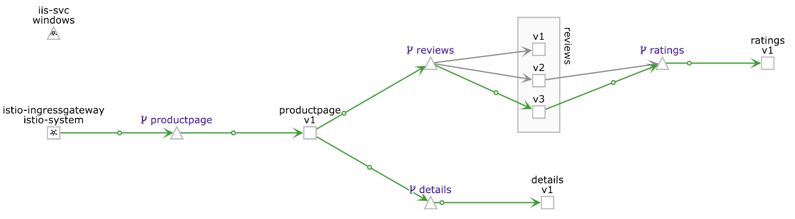


### 04.5 - Shift to Reviews V2 when Jason, else Reviews V3

```yaml
apiVersion: networking.istio.io/v1alpha3
kind: VirtualService
metadata:
  name: reviews
spec:
  hosts:
  - reviews
  http:
  - match:
    - headers:
        end-user:
          exact: jason
    route:
    - destination:
        host: reviews
        subset: v2
  - route:
    - destination:
        host: reviews
        subset: v3
```

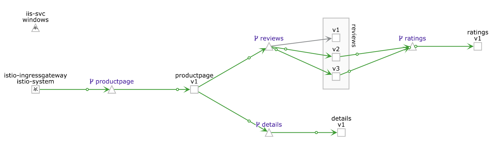

### 05 - Delay 2 Seconds and Route to Ratings V1

```yaml
apiVersion: networking.istio.io/v1alpha3
kind: VirtualService
metadata:
  name: ratings
spec:
  hosts:
  - ratings
  http:
  - fault:
      delay:
        percent: 100
        fixedDelay: 2s
    route:
    - destination:
        host: ratings
        subset: v1
```

### 06 - Cause a timeout error if Reviews does not return in 0.5 Seconds

```yaml
apiVersion: networking.istio.io/v1alpha3
kind: VirtualService
metadata:
  name: reviews
spec:
  hosts:
  - reviews
  http:
  - route:
    - destination:
        host: reviews
        subset: v2
    timeout: 0.5s
```

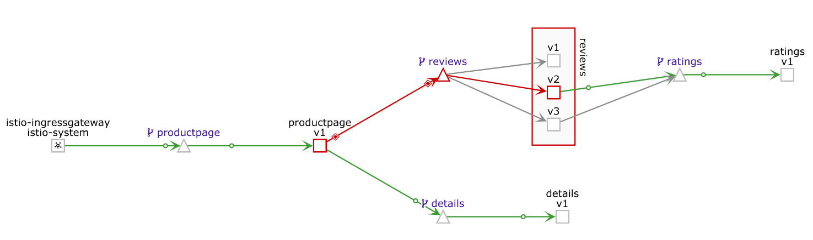

### 07 - If Jason, 7 Second delay on Reviews V2, else route to v1

```yaml
apiVersion: networking.istio.io/v1alpha3
kind: VirtualService
metadata:
  name: reviews
spec:
  hosts:
    - reviews
  http:
  - match:
    - headers:
        end-user:
          exact: jason
    route:
    - destination:
        host: reviews
        subset: v2
  - route:
    - destination:
        host: reviews
        subset: v1
```

```yaml
apiVersion: networking.istio.io/v1alpha3
kind: VirtualService
metadata:
  name: ratings
spec:
  hosts:
  - ratings
  http:
  - match:
    - headers:
        end-user:
          exact: jason
    fault:
      delay:
        percent: 100
        fixedDelay: 7s
    route:
    - destination:
        host: ratings
        subset: v1
  - route:
    - destination:
        host: ratings
        subset: v1
```

- When NOT Jason

    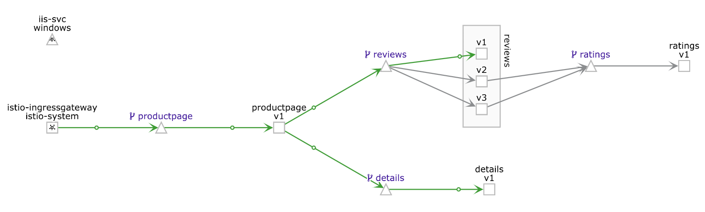

- When Jason


    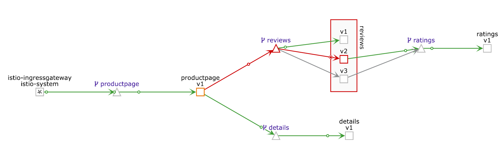

### 09.1 Install MongoDB and Rating Service

- MongoDB Deployment and Service

```yaml
apiVersion: v1
kind: Service
metadata:
  name: mongodb
  labels:
    app: mongodb
spec:
  ports:
  - port: 27017
    name: mongo
  selector:
    app: mongodb
---
apiVersion: extensions/v1beta1
kind: Deployment
metadata:
  name: mongodb-v1
spec:
  replicas: 1
  template:
    metadata:
      labels:
        app: mongodb
        version: v1
    spec:
      containers:
      - name: mongodb 
        image: istio/examples-bookinfo-mongodb:1.8.0
        imagePullPolicy: IfNotPresent
        ports:
        - containerPort: 27017
```

- Ratings V2 Deployment and Service

```yaml
apiVersion: extensions/v1beta1
kind: Deployment
metadata:
  name: ratings-v2
spec:
  replicas: 1
  template:
    metadata:
      labels:
        app: ratings
        version: v2
    spec:
      containers:
      - name: ratings
        image: istio/examples-bookinfo-ratings-v2:1.8.0
        imagePullPolicy: IfNotPresent
        env:
          - name: MONGO_DB_URL
            value: mongodb://mongodb:27017/test
        ports:
        - containerPort: 9080
```

- Review and Rating Virtual Services

```yaml
apiVersion: networking.istio.io/v1alpha3
kind: VirtualService
metadata:
  name: reviews
spec:
  hosts:
  - reviews
  http:
  - route:
    - destination:
        host: reviews
        subset: v2
      weight: 30
    - destination:
        host: reviews
        subset: v3
      weight: 70
---
apiVersion: networking.istio.io/v1alpha3
kind: VirtualService
metadata:
  name: ratings
spec:
  hosts:
  - ratings
  http:
  - route:
    - destination:
        host: ratings
        subset: v2
      weight: 70
    - destination:
        host: ratings
        subset: v1
      weight: 30
```

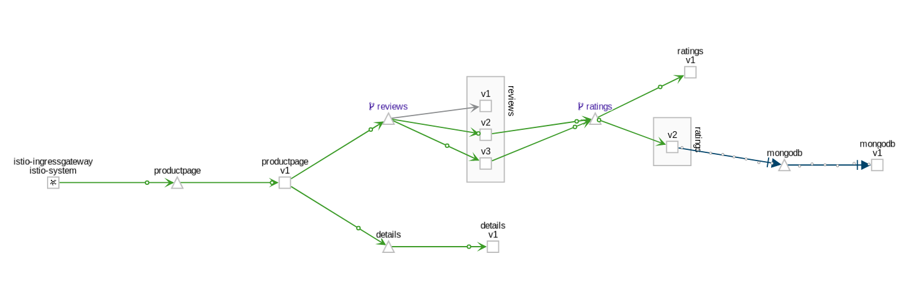

### 09.8 MySQL Access to Remove VM

- Create the Service in a separate namespace

```
kubectl create namespace vm

istioctl register -n vm mysqldb $MYSQL_HOST 3306
```

- Deployment

```yaml
apiVersion: extensions/v1beta1
kind: Deployment
metadata:
  name: ratings-v2-mysql-vm
spec:
  replicas: 1
  template:
    metadata:
      labels:
        app: ratings
        version: v2-mysql-vm
    spec:
      containers:
      - name: ratings
        image: istio/examples-bookinfo-ratings-v2:1.8.0
        imagePullPolicy: IfNotPresent
        env:
          # This assumes you registered your mysql vm as
          # istioctl register -n vm mysqldb 1.2.3.4 3306
          - name: DB_TYPE
            value: "mysql"
          - name: MYSQL_DB_HOST
            value: mysqldb.vm.svc.cluster.local
          - name: MYSQL_DB_PORT
            value: "3306"
          - name: MYSQL_DB_USER
            value: $MYSQL_USER
          - name: MYSQL_DB_PASSWORD
            value: $MYSQL_PASSWORD
        ports:
        - containerPort: 9080
```

- Virtual Services

```yaml
apiVersion: networking.istio.io/v1alpha3
kind: VirtualService
metadata:
  name: reviews
spec:
  hosts:
  - reviews
  http:
  - route:
    - destination:
        host: reviews
        subset: v2
      weight: 20
    - destination:
        host: reviews
        subset: v3
      weight: 80
---
apiVersion: networking.istio.io/v1alpha3
kind: VirtualService
metadata:
  name: ratings
spec:
  hosts:
  - ratings
  http:
  - route:
    - destination:
        host: ratings
        subset: v2
      weight: 50
    - destination:
        host: ratings
        subset: v2-mysql-vm
      weight: 50
```

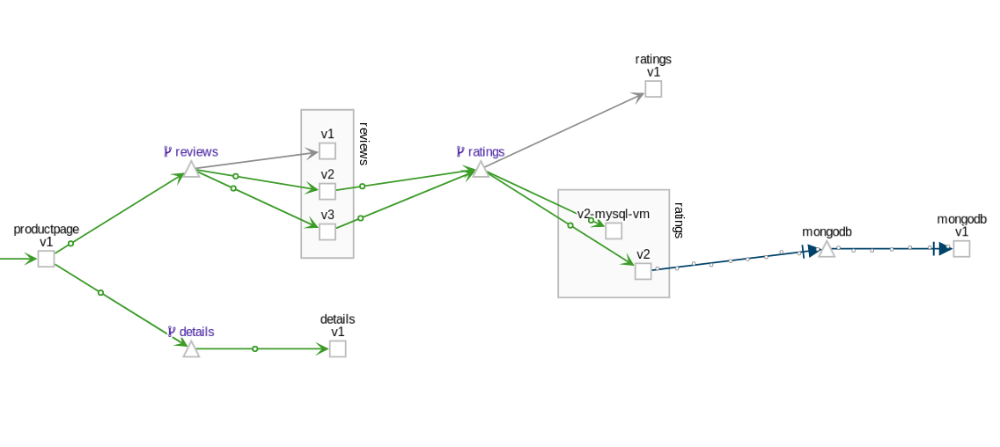

## Egress Access

### 10.1 Create Sleep Service

```yaml
apiVersion: v1
kind: Service
metadata:
  name: sleep
  labels:
    app: sleep
spec:
  ports:
  - port: 80
    name: http
  selector:
    app: sleep
---
apiVersion: extensions/v1beta1
kind: Deployment
metadata:
  name: sleep
spec:
  replicas: 1
  template:
    metadata:
      labels:
        app: sleep
    spec:
      containers:
      - name: sleep
        image: pstauffer/curl
        command: ["/bin/sleep", "3650d"]
        imagePullPolicy: IfNotPresent
```

### 10.2 Test Calling httpbin.org

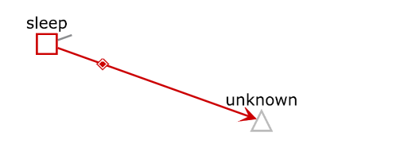

### 10.3 Service Entry for httpbin.org

```yaml
apiVersion: networking.istio.io/v1alpha3
kind: ServiceEntry
metadata:
  name: httpbin-ext
spec:
  hosts:
  - httpbin.org
  ports:
  - number: 80
    name: http
    protocol: HTTP
  resolution: DNS
  location: MESH_EXTERNAL
```

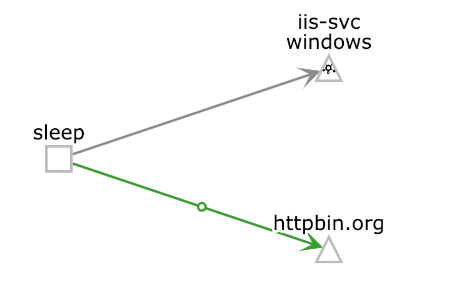

### 10.4 Google Service Entry

```yaml
apiVersion: networking.istio.io/v1alpha3
kind: ServiceEntry
metadata:
  name: google
spec:
  hosts:
  - www.google.com
  ports:
  - number: 443
    name: https
    protocol: HTTPS
  resolution: DNS
  location: MESH_EXTERNAL
---
apiVersion: networking.istio.io/v1alpha3
kind: VirtualService
metadata:
  name: google
spec:
  hosts:
  - www.google.com
  tls:
  - match:
    - port: 443
      sni_hosts:
      - www.google.com
    route:
    - destination:
        host: www.google.com
        port:
          number: 443
      weight: 100
```

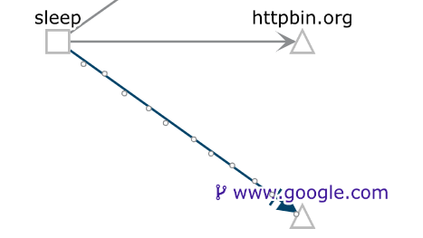

### 10.6 Access to IIS-Window Service

```yaml
apiVersion: networking.istio.io/v1alpha3
kind: ServiceEntry
metadata:
  name: winiis-ext
spec:
  hosts:
  - <HOST ADDRESS>
  ports:
  - number: 31699
    name: http
    protocol: HTTP
  resolution: DNS
  location: MESH_EXTERNAL
```

