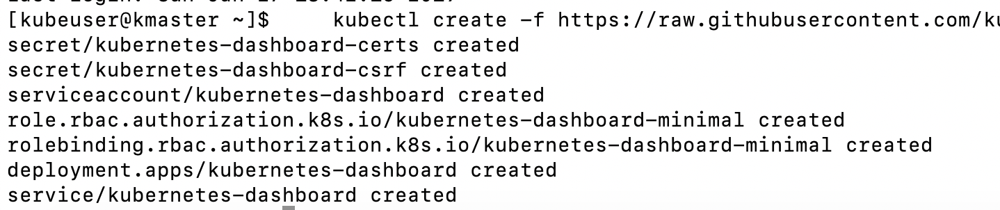
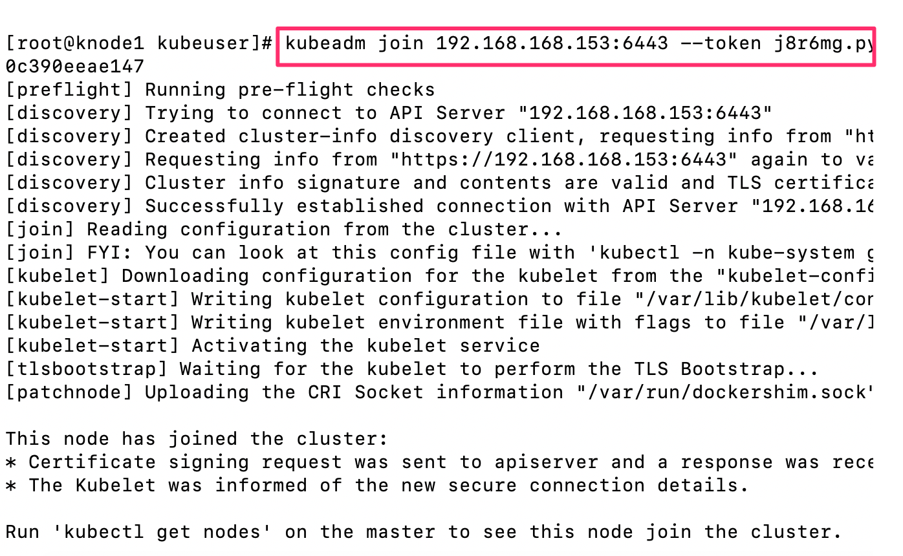
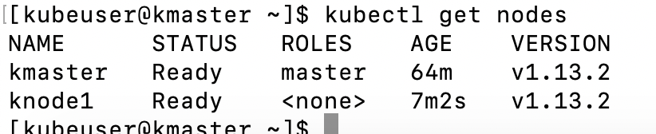
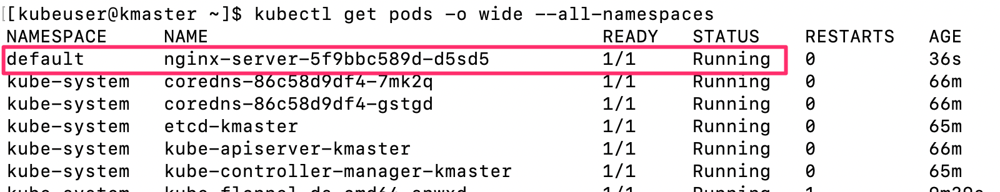
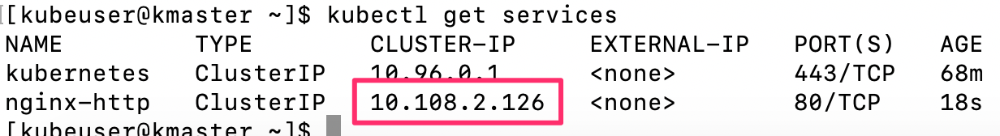

# Setup Kubernetes

If you plan on including Windows nodes, you need to set up the Flannel Network and Proxy configuration using **Host Gateway Mode**, as apposed to **VXLAN** Mode. Choose the correct version of **Step 1** based on the desire to include Windows nodes.

## Flannel Install

### ***Step 1***: With ***No Windows Nodes*** - Install the Flannel Network

The following is to be performed on the **kmaster** image

- Notice that not all pods are working. We will resolve this by installing the pod network. In our example we are going to use a **Flannel** network. 

- ***Run commands*** as `kubeuser` at the **$** prompt - **NOT** at the sudo **#** prompt

    ```
    $ kubectl apply -f https://raw.githubusercontent.com/coreos/flannel/master/Documentation/kube-flannel.yml
    ```

    

- Go to **Step 2**

### ***Step 1***: With the potential of having a ***Windows Node(s)*** - Install the Flannel Network as follows:

- Patch the linux kube-proxy DaemonSet to target Linux only. 

    Run commands as `kubeuser` at the **$** prompt
    ```
    kubectl get ds/kube-proxy -o go-template='{{.spec.updateStrategy.type}}{{"\n"}}' --namespace=kube-system
    ```

- Create this file

    ```
    vi node-selector-patch.yml
    ```
- Past the fillowing into the file, and save

    ```yaml
    spec:
      template:
        spec:
          nodeSelector:
            beta.kubernetes.io/os: linux
    ```

- Patch the damon setls


    ```
    kubectl patch ds/kube-proxy --patch "$(cat node-selector-patch.yml)" -n=kube-system
    ```

- check on the patch

    ```
    kubectl get ds -n kube-system
    ```

    

- Follow the instruction from here titled **Collecting Cluster Info** to identify some of the information needed later.

    [Microsoft Doc](https://docs.microsoft.com/en-us/virtualization/windowscontainers/kubernetes/creating-a-linux-master)

- It is recommended to enable bridged IPv4 traffic to iptables chains when using Flannel. This can be done using the following command:

    ```
    sysctl net.bridge.bridge-nf-call-iptables
    ```

    if not set to 1

    ```
    sudo sysctl net.bridge.bridge-nf-call-iptables=1
    ```

- Download the recent Flannel Config file

    ```
    wget https://raw.githubusercontent.com/coreos/flannel/master/Documentation/kube-flannel.yml
    ```

- Run the following **sed** command to change `vxlan` to `host-gw` in the **kube-flannel.yml** file

    ```bash
    sed 's/vxlan/host-gw/' -i kube-flannel.yml
    ```

- Apply the flannel network

    ```
    kubectl apply -f kube-flannel.yml
    ```

- View the pods and wait for the **coredns** pods to show running

    ```
    kubectl get pods -o wide --all-namespaces
    ```

    


- Apply the patch to the Flannel Network - ***Note**: Ensure that you select the correct flannel pod for your system. In this example, I'm using **amd64**, but you might use arm, arm64, ppc64le, s390x, etc.

    ```
    kubectl patch ds/kube-flannel-ds-amd64 --patch "$(cat node-selector-patch.yml)" -n=kube-system
    ```

- check on the patch

    ```
    kubectl get ds -n kube-system
    ```

    

## Dashboard Install
    
### **Step 2**: Install the Dashboard

- We are going to install the Dashboard prior to joining a node. Installing with only the Master node available will cause the Dashboard to be installed on the Master Node, which is a good practice. Run the following command to install the Dashboard

    ```
    kubectl create -f https://raw.githubusercontent.com/kubernetes/dashboard/master/aio/deploy/recommended/kubernetes-dashboard.yaml

    ```
    

- Wait for the kube dashboard to show a **Running** state

    ```
    kubectl get pods -o wide --all-namespaces
    ```

    

- Open another terminal and create a Service Account

    ```
    kubectl create serviceaccount dashboard -n default
    ```

    ```
    kubectl create clusterrolebinding dashboard-admin -n default \
    --clusterrole=cluster-admin \
    --serviceaccount=default:dashboard
    ```

- Get the Secrect and save it for later use. Note, you can always recoved this credential by re-running the command below.

    ```
    kubectl get secret $(kubectl get serviceaccount dashboard -o jsonpath="{.secrets[0].name}") -o jsonpath="{.data.token}" | base64 --decode
    ```

    

- Run the proxy command so we can access the Kubernetes Dashboard

    ```
    kubectl proxy
    ```

- Load the the Firefox browser and go to the following URL:

    ```
    http://localhost:8001/api/v1/namespaces/kube-system/services/https:kubernetes-dashboard:/proxy/
    ```

- Select the **Token** option, and enter the Secret you just created

    

- Click on the **Save** button to save the token

    

## Join the Node

### **Step 3**: Join the knode1 **(Linux)** node to the kmaster

***Note:*** The following step's command must be run only on the "Node"

- **VERIFY** that you are on the **KNODE1** Image

- On the **knode1** image open a **terminal** window and run the following command:
    
    ```
    sudo su
    ```

 - Use the **kubeadm join** command you saved earlier to join **knode** to **kmaster**

    
    
### **Step 3**: Install a test application

***Note:*** The commands in this step are run on the "Master"

- ***Return to a terminal window*** on the **kmaster** image and run the following command. Wait until **knode1** shows a **Ready** state

    Run commands as `kubeuser` at the **$** prompt
    ```
    kubectl get nodes
    ```

    

- Run the following command to deploy the **nginx** service and deployment

    ```yaml
    cat <<EOF | kubectl apply -f -
    apiVersion: v1
    kind: Service
    metadata:
      name: nginx-server
      namespace: default
      labels:
        app: nginx-server
    spec:
      ports:
      - port: 80
        name: http
      selector:
        app: nginx-server
    ---
    apiVersion: extensions/v1beta1
    kind: Deployment
    metadata:
      name: nginx-http
      namespace: default
    spec:
      replicas: 1
      template:
        metadata:
          labels:
            app: nginx
        spec:
          containers:
          - name: nginx-server
            image: nginx
            imagePullPolicy: IfNotPresent
            ports:
            - containerPort: 80
    EOF
    
    ```

- Execute the following command to see the nginx-server

    ```
    kubectl get pods -o wide --all-namespaces
    ```

- Wait for the nginx to show running

    

- Expose the port

    ```
    kubectl expose deployment nginx-server --port=80 --name=nginx-http
    ```

- Get the service info

    ```
    kubectl get service
    ```

    

- Run curl command using ip from get service command

    ```
    curl -I <IP ADDRESS>
    ```

    

- Access from the browser

    

- If you are going to Create a **Windows Node**, go [WindowsNode.md Document](./WindowsNode.md)

**OR**

- Got to the [Istio.md Document](./README.md) to install and configure Istio

