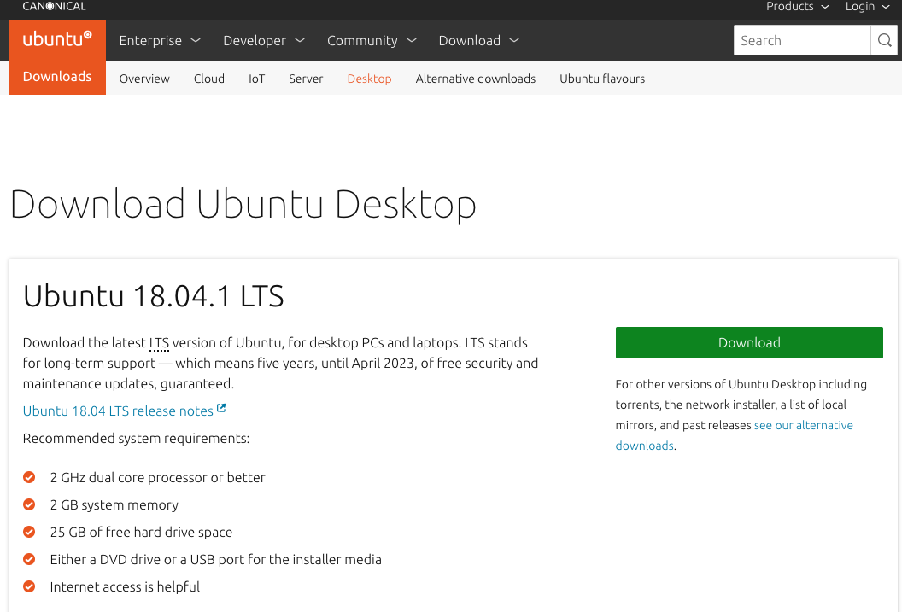
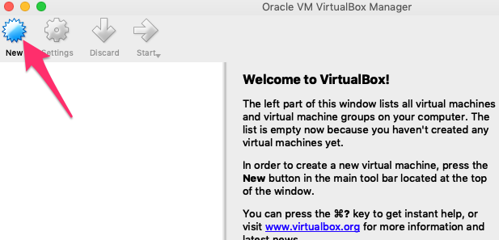
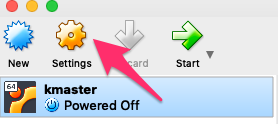
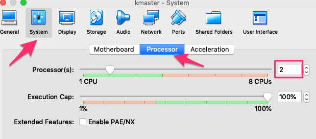
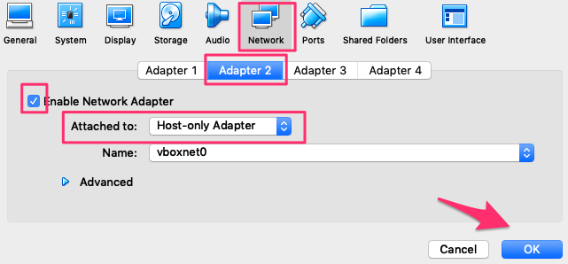

# kubernetes-tutorial
Test tutorial

## Install the Master and Minion 
### Download Ubuntu 18.0.4 Desktop ISO

- From this URL [Ubuntu Destop Downloads](https://www.ubuntu.com/download/desktop), get the iso image
- Select the latest (LTM) image. I'm using 18.04.1 LTS

    

- Select the Latest (LTS) 

### Create a Virtual Box ***kmaster*** node/image

- Load VirtualBox and click on ***New***

    

- Enter the following, and click on ***Commit***:
    - Name: `kubernetes`
    - Type: `Linux`
    - Version: `Ubuntu (64-bit)`
    - Hard disk: ***Create a virtual hard disk now***

    

- Enter the following Disk Information and click on ***Commit***
    - File Location: `kmaster`
    - File Size: `30GB`
    - Hard disk file type: `VDI (VirtualBox Disk Image)

    

- With **kmaster** selected, click on ***settings***

    

- Select ***System*** and ***Processor***
- Set the number of CPUs to at least `2`

    

- Click on ***Network*** and ***Adapter 2*** in the tool bar
- Click on ***Enable Network Adapter***
- For Attached to, select ***Host-only Adapter***
- Click on ***OK***

    