# kubernetes-tutorial
In this tutorial we will install 2 VM Images. One will server as the Kubernetes master, and the other a Kubernetes Node. We'll configure Docker and Kubernetes on both Images. 

## Install the Master and Node 

### Download Ubuntu 18.0.4 Desktop ISO

- From this URL [Ubuntu Destop Downloads](https://www.ubuntu.com/download/desktop), get the iso image
- Select the latest (LTM) image. I'm using 18.04.1 LTS

    

- Select the Latest (LTS) 

### **Step 1**: Create a Virtual Box **kmaster** node/image

The following steps use VMWare Fusion, but using the concepts displayed below, you can make these examples work with VMWare workstation and VirtualBox.

- Load VMWare Fusion, click on **+** sign, and select **New**

    

- Drag the iso image you downloaded, and drop it onto the Install window  

    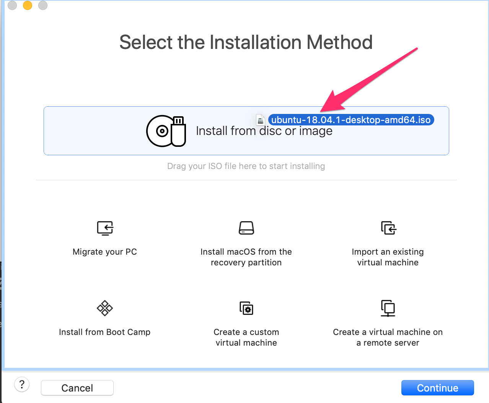

- Select the iso you just added, and click on **Continue**

    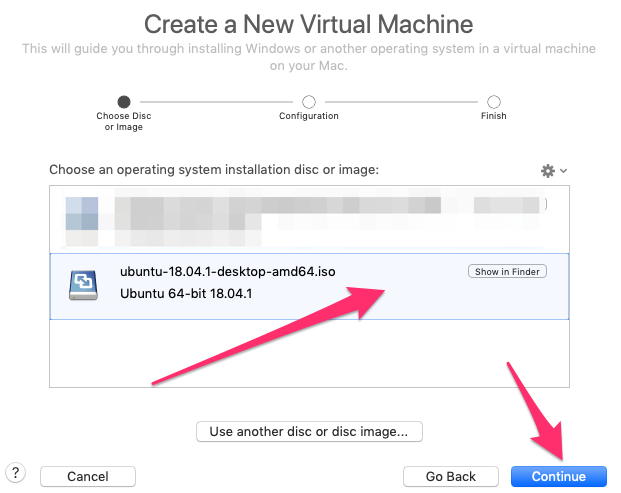

- Uncheck the **Use Easy Install** option, and click on Continue

    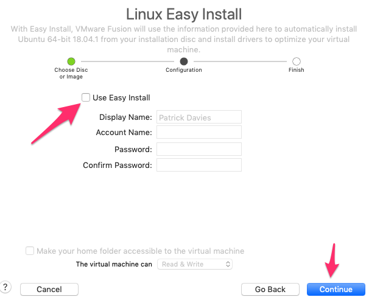

- Take the default **Legacy BIOS** option on the **Choose Firmware Type**, and click on **Continue**

- Click on the **Customize Settings** Button

    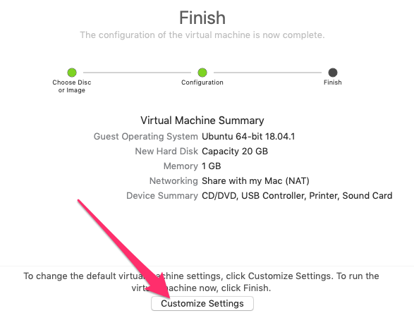

- Use the default **Save As** File Name, and click on **Save**

    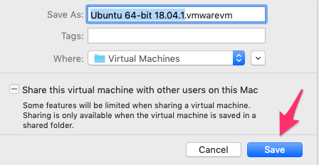

- Click on the **General** setting icon in the main dashboard

    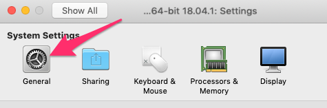

- Change the name to `kmaster` and click on **Show All** to return to the main menu

    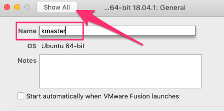

- From the main menu select **Processors & Memory**, set the Processors to at least **2 processor cores** and then select **4GB** of RAM. Return to the main menu by click on **Show All**

    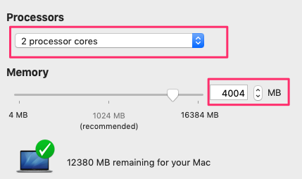

- From the main menu click on **Add Device**

    

- Select **Network Adapter** and click on **Add**

    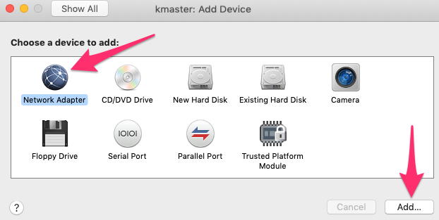

- Scroll to the **Custom** networks, and select **Private to my ...** network. return to the main menu

    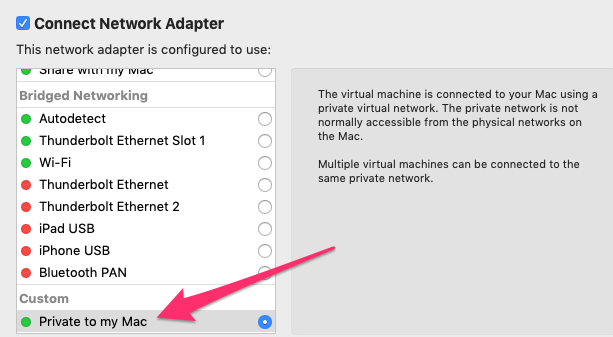

- Select **Hard Disk** from the main menu

    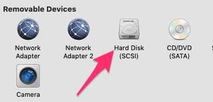

- Setting the **Disk Size** to **30GB**, click on **Apply** and return to the main menu

    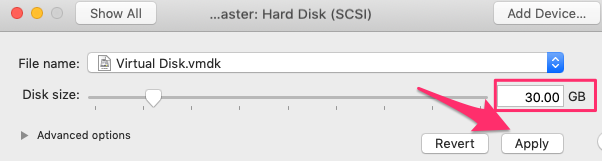

- Click on the **Play** icon to start the VM

    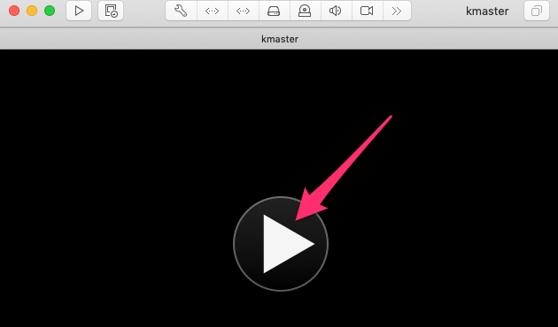

### **Step 2**: Install Ubuntu

- Once the image starts, click on **Install Ubuntu**

    

- Select your keyboard layout and click on Continue
- I selected the **Minimal installation**, but the normal installation will also work
- Click on Continue

    

- Keep the **Erase disk and install Ubuntu** defaults, and click on **Install Now**

    

- Click on **Continue** when asked about Writing changes to disk.
- Select your timezone
- Configure the username and hostname:
    - Your Name: `kubeuser`
    - Your Computer: `kmaster`
    - Pick a username: `kubeuser`
    - I selected **Log in automatically**

    

- When prompted, click on **Restart Now**

- When prompted with **Please remove the installation medium, then press ENTER:**, press the **Enter Key** in the image. Note: you can generally just press enter, as VBox will have automatically remove the ubuntu ISO during the installation process. If not, you can remove it using the **Settings**

- Once the Image has started, **Right Click** on the desktop and Open a **Terminal Window**

    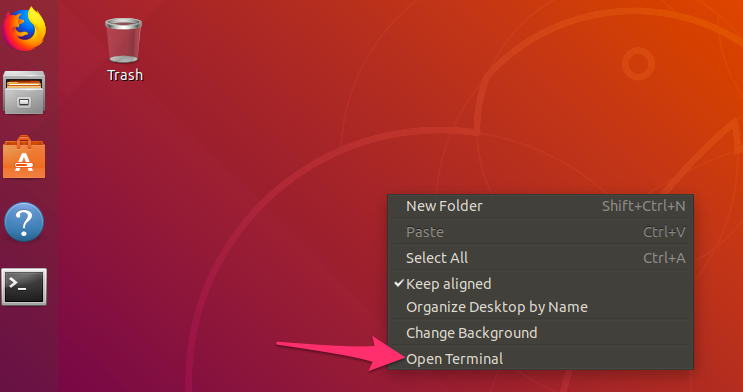

- In the terminal window, install the VMWare Tools. Enter your password if prompted, and also enter **Y** if asked to continue

    ```
    $ sudo apt install open-vm-tools-desktop
    ```

- Enter **reboot** to restart the image

    ```
    $ reboot
    ```

    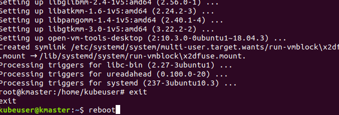

### **Step 3**: Create a **knode** Ubuntu image

- Repeat **Steps 1 and 2** to create a kubernetes slave image, with the following **modifications**:
    - Changes any references of `kmaster` to `knode` 
    - Set the RAM to 3GB

- You should now have both the **kmaster** and **knode** images running:

    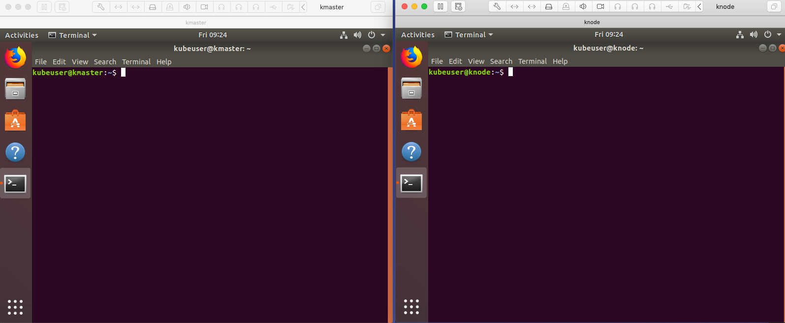

### **Step 4**: Perform package installations on **BOTH** images

- The following tasks are to be **run on both** the master and node images:

- Optional: If you want to turn off asking for a password when using the `sudo su` command, then follow these tasks:
    - From your terminal window enter:

    ```
    $ sudo visudo
    ```

    - At the bottom of the file, enter this line:

    ```
    kubeuser ALL=(ALL) NOPASSWD:ALL
    ```

    

    - Save the file by pressing **Ctrl+X**, then enter **Y** and hit **Enter** to save the file.

- Login as 'sudo' and run the following commands :

    ```
    $ sudo su
    # apt-get update
    ```

    

- Kubernetes will throw errors if the swap space is not turned off. The following commands will turn swap off (These commands are also run as sudo user):

    ```
    # swapoff -a
    # nano /etc/fstab
    ```

- Comment out the line that references the **swapfile**. Then hit **Ctrl+X**, press **Y** and hit **Enter** to save the file.

    

- As sudo, check to ensure that the host file contains `kmaster` and `knode` on the respective images

    ```
    # nano /etc/hostname
    ```

    

- As sudo, install net-tools

    ```
    # apt-get install net-tools
    ```

    

- As sudo, on each image run ifconfig, and note the **network name and ip address** for the Host only network adapter for both kmaster and knode

    ```
    # ifconfig
    ```

    In my example, here is **KMASTER**:

    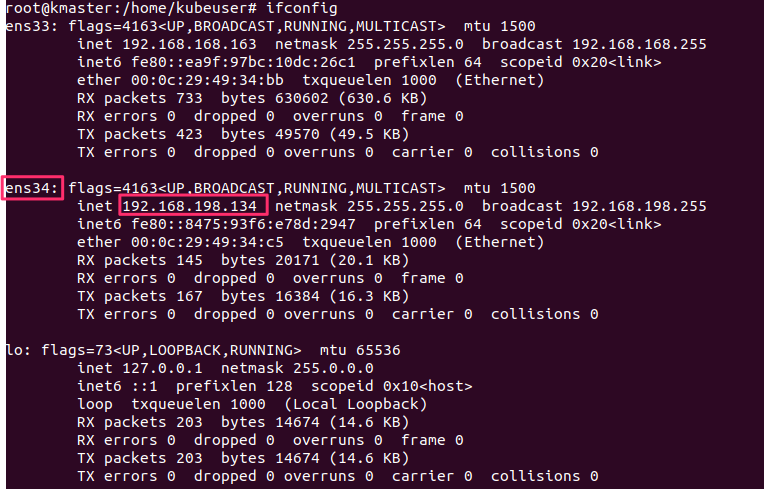

    Here is **KNODE**:

    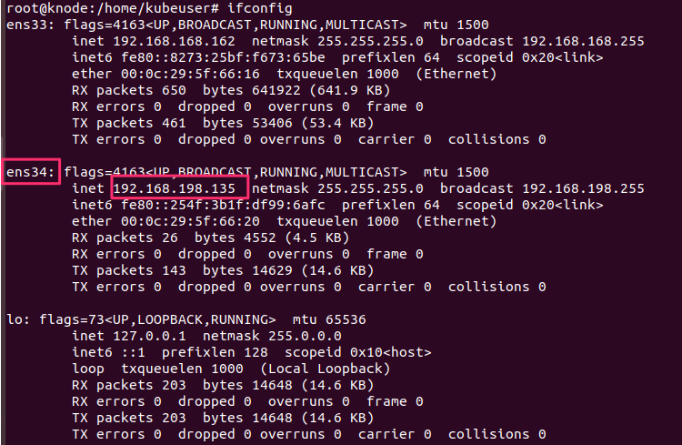

- As sudo, set the host file in ***both images*** to reference the **kmaster** and **knode** ip addresses

    ```
    # nano /etc/hosts
    ```

    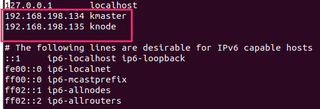

- To use the IPs assigned your image as Staic IPs, edit the /etc/network/interfaces file

    ```
    # nano /etc/network/interfaces
    ```

- Add the entry below to the bottom of the file, but change the **Network Name (ens34)** and the **IP Address 192.168.198.135** to match what you recorded using the **ifconfig** command
    ```
    auto ens34
    iface ens34 inet static
    address 192.168.198.135
    ```

    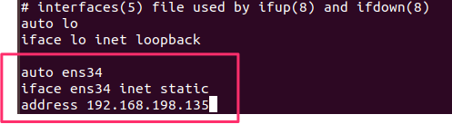

- As sudo, install open ssh server. This will allow you to connect to the Images from your host.

    ```
    # apt-get install openssh-server
    ```

    

### **Step 5**: Install Docker on **BOTH** images

- As sudo, run the following commands to install docker

    ```
    # apt-get update
    # apt-get install -y docker.io
    ```

- Enable to docker service

    ```
    # systemctl enable docker.service
    ```

### **Step 6**: Reboot Servers

- Reboot your **Images** by entering the `reboot` command in the terminal window. If desired, you could also snapshot the image. 

    ```
    # reboot
    ```

### **Step 7**: Install Kubernetes on **BOTH** images

- As sudo, run the following command to install kubernetes

    ```
    $ sudo su
    ```

    ```
    # apt-get update && apt-get install -y apt-transport-https curl
    ```

    ```
    # curl -s https://packages.cloud.google.com/apt/doc/apt-key.gpg | apt-key add -
    ```

    ```
    # cat <<EOF >/etc/apt/sources.list.d/kubernetes.list
    deb http://apt.kubernetes.io/ kubernetes-xenial main
    EOF
    ```

    ```
    # apt-get update
    ```

- As sudo, install **Kubelet, kubeadmn, and kubectl**

    ```
    # apt-get install -y kubelet kubeadm kubectl 
    ```

- Update the Kubernetes config file

    ```
    # nano /etc/systemd/system/kubelet.service.d/10-kubeadm.conf
    ```

- Add the following **Environment** entry to the config file

    ```
    Environment="cgroup-driver=systemd/cgroup-driver=cgroupfs"
    ```

    

### **Step 8**: Configure Kubernetes Master - Run **ONLY on kmaster** image

- As sudo, start the kubernetes cluster. **Note**: We will be using a Flannel network, so we are using 10.244.0.0/16 for the pod-network-cidr, and this address does not need to be changed. However, **Replace** the text (`REPLACE-WITH-kmaster-IPADDRESS`) with your kmaster's host address.

    ```
    # kubeadm init --pod-network-cidr=10.244.0.0/16 --apiserver-advertise-address=REPLACE-WITH-kmaster-IPADDRESS
    ```

    

- When the kubeadm init command completes, copy the **kubeadm join** command and save it, as this command will later be used to join **knode** to the cluster

    

- You will **NOT** run the next command from the sudo user **#** prompt, so ensure that you exit the sudo user and the **$** prompt is visible

    

    ```
    # exit
    $ mkdir -p $HOME/.kube
    $ sudo cp -i /etc/kubernetes/admin.conf $HOME/.kube/config
    $ sudo chown $(id -u):$(id -g) $HOME/.kube/config
    ```

    

- Ensure that kubectl is working. Wait for all pods to be in a **Running** state, with the exception of the **corends** pods

    ```
    $ kubectl get pods -o wide --all-namespaces
    ```

    

### ***Step 9***: Install the Flannel Network

- Notice that not all pods are working. We will resolve this by installing the pod network. In our example we are going to use a **Flannel** network. 

    ```
    $ kubectl apply -f https://raw.githubusercontent.com/coreos/flannel/master/Documentation/kube-flannel.yml
    ```

    

- Now that the flannel network is installed, you should see that the **coredns...** pods are now in a **running** status. You'll need to re-run the command below multiple times until everything restarts.

    ```
    $ kubectl get pods -o wide --all-namespaces
    ```

    

    ```
    $ kubectl create -f https://raw.githubusercontent.com/kubernetes/dashboard/master/src/deploy/recommended/kubernetes-dashboard.yaml
    ```
    

- Wait for the kube dashboard to show a **Running** state

    ```
    $ kubectl get pods -o wide --all-namespaces
    ```

    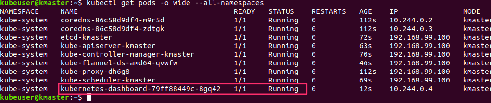

- Run the proxy command so we can access the Kubernetes Dashboard

    ```
    $ kubectl proxy
    ```

    

- Open another terminal and create a Service Account

    ```
    $ kubectl create serviceaccount dashboard -n default
    ```

    

    ```
    $ kubectl create clusterrolebinding dashboard-admin -n default \
    --clusterrole=cluster-admin \
    --serviceaccount=default:dashboard
    ```

    

- Get the Secrect and save it for later use

    ```
    $ kubectl get secret $(kubectl get serviceaccount dashboard -o jsonpath="{.secrets[0].name}") -o jsonpath="{.data.token}" | base64 --decode
    ```

    

- Load the the Firefox browser and go to the following URL:

    ```
    http://localhost:8001/api/v1/namespaces/kube-system/services/https:kubernetes-dashboard:/proxy/
    ```

- Select the **Token** option, and enter the Secret you just created

    

- Click on the **Save** button to save the token

    

### **Step 10**: Join knode to the kmaster

***Note:*** The following step's command must be run only on the "Node"

- On the **knode** image impen a **terminal** window and run the following command:
    
    ```
    $ sudo su
    ```

 - Use the **kubeadmin join** command you saved earlier to join **knode** to **kmaster**

    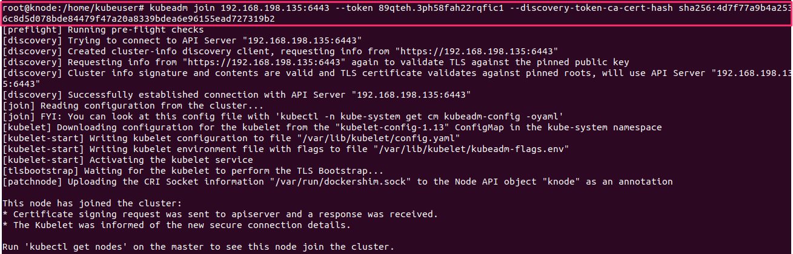

    
### **Step 11**: Install a test application

***Note:*** The commands in this step are run on the "Master"

- Return to a terminal window on the **kmaster** image and run the following command. Wait until **knode** shows a **Ready** state

    ```
    $ kubectl get nodes
    ```

    

- Run the following command to install the **nginx** server pod

    ```
    $ kubectl run --image=nginx nginx-server --port=80 --env="DOMAIN=cluster"
    ```

- Execute the following command to see the nginx-server

    ```
    $ kubectl get pods -o wide --all-namespaces
    ```

- Wait for the nginx to show running

    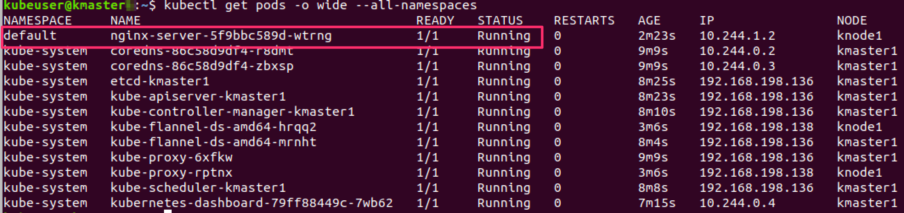

- Expose the port

    ```
    $ kubectl expose deployment nginx-server --port=80 --name=nginx-http
    ```

- Get the service info

    ```
    $ kubectl get service
    ```

    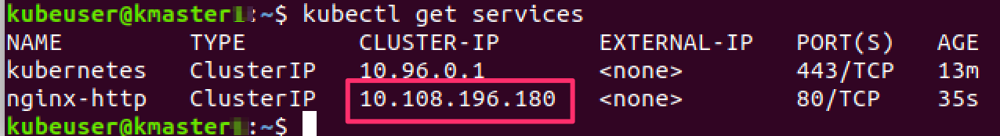

- Run curl command using ip from get service command

    ```
    $ curl -I <IP ADDRESS>
    ```

    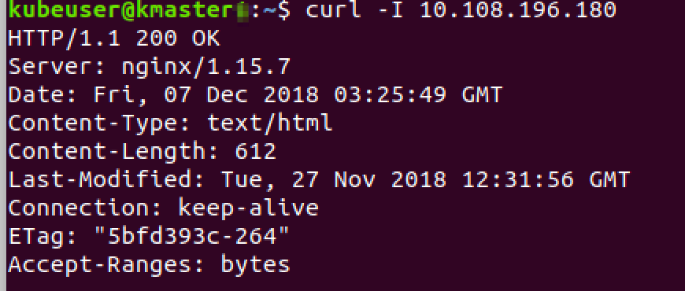

- Access from the browser

    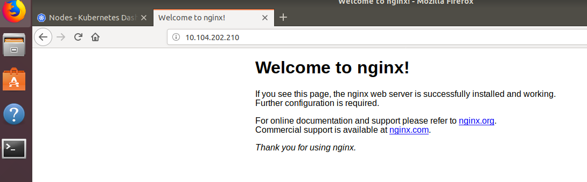


