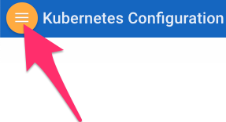

# kubernetes-tutorial

## Github Pages View
Note: This Tutorial's pages are best viewed using the Github Pages view of the Repository. Click here to go to [https://pcdavies.github.io/kubernetes-tutorial/index.html](https://pcdavies.github.io/kubernetes-tutorial/index.html). Once the new view loads, from any section of the Tutorial you can click on the Icon in the top left corner to see a list of the Tutorial Sections:

## Overview:
In this tutorial. we will install 2 VM Images - with an opitonal 3rd for Windows support. One will serve as the Kubernetes master, and the other as a Kubernetes Node. We'll configure Docker and Kubernetes on both Images. 

## **Step 1**: Install the Master and Slave Images, and Stage Kubernetes

- Go here for [CentOS 7](./CentOS.md)  Installation and Configuration

## **Step 2**: Complete Kubernetes Network Config/Sample App install

- [Kubernetes Network Config](./KubeNetConfig.md) and Sample App Install

## **Step 3**: Optionally, install and configure a Windows Node

- [Windows 1809](./WindowsNode.md) and Sample App Install

## **Step 4**: Install Nginx for Ingress

- [Nginx Config](./Nginx.md) and Install

## **Step 5**: Optional - install and configure Istio

- [Istio Config](./Istio.md) and Sample App Install

## **Step 6**: Optional - Istio Demos

- [Istio Demos](./Demos.md) Istio Booking Demo Scripts

