# Setup the Windows Node

## Create the windows image

### **Step 1**: Download Windows server 1809

### **Step 2**: Install the Windows Image: 

- Using VMWare Fusion, install widnows server 1809 image - the following screen shots will provide an overview the options I selected to install the image

     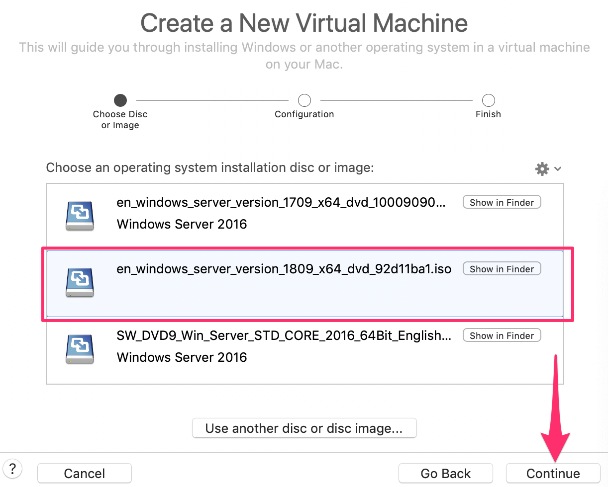
     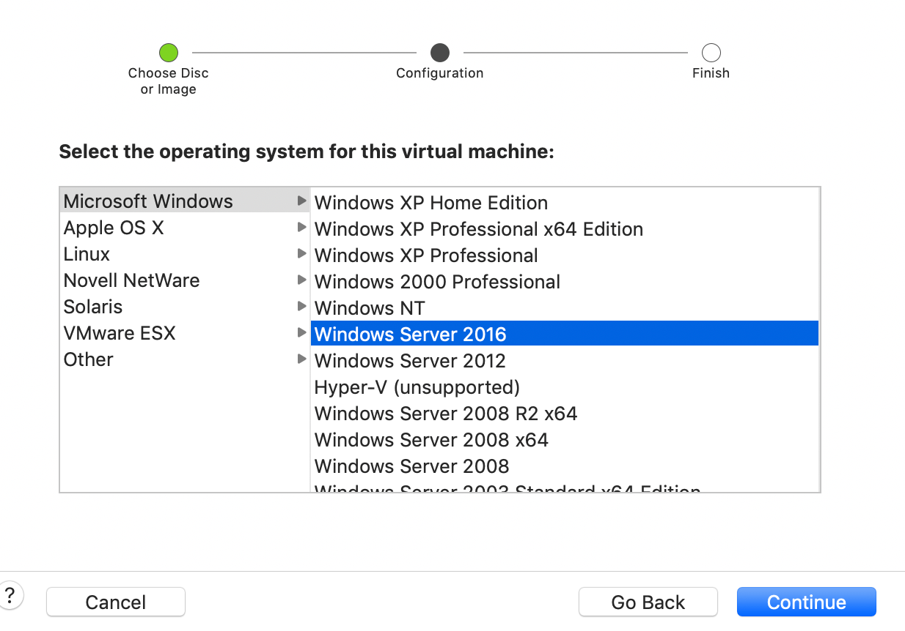
     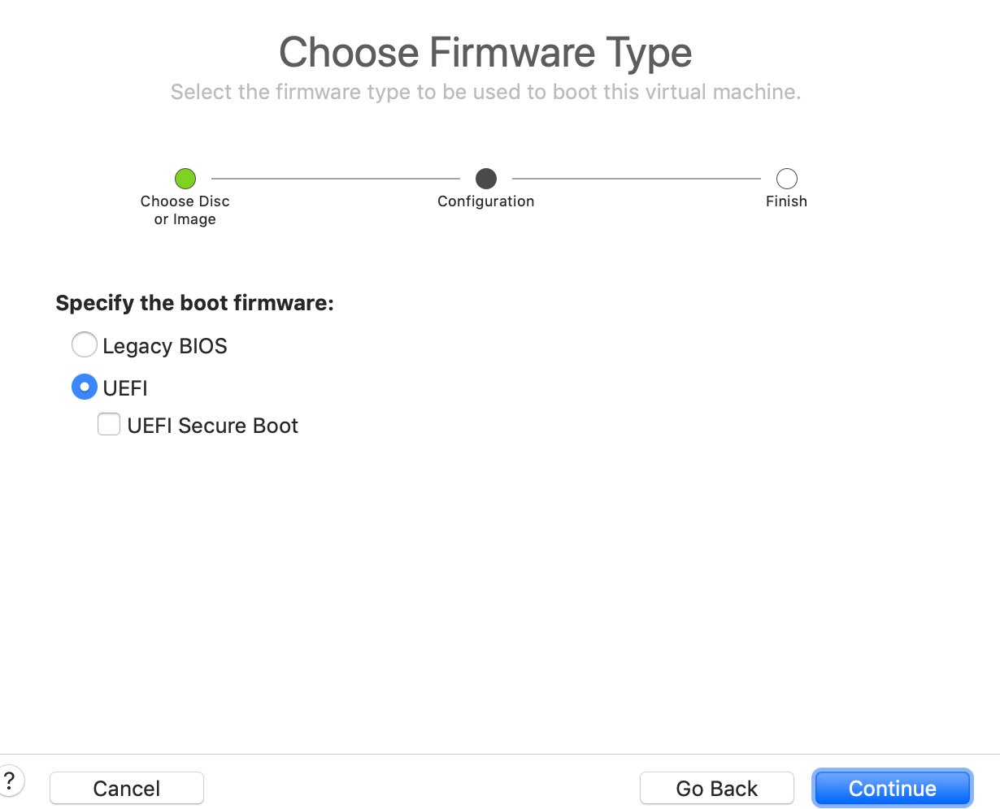
     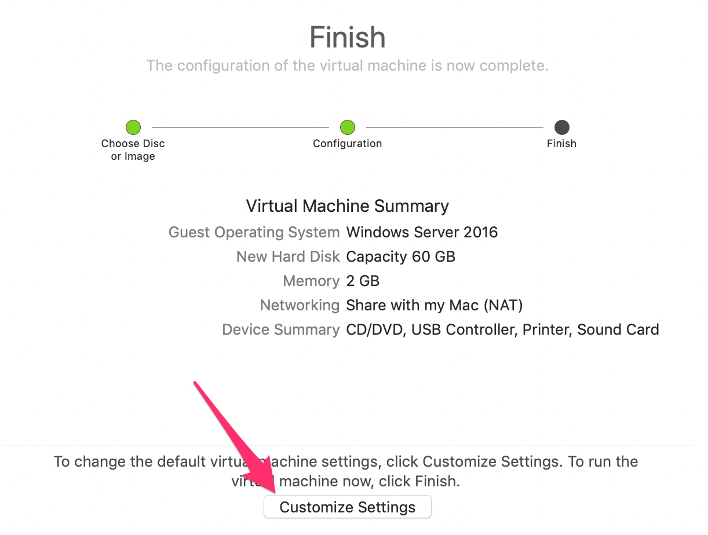
     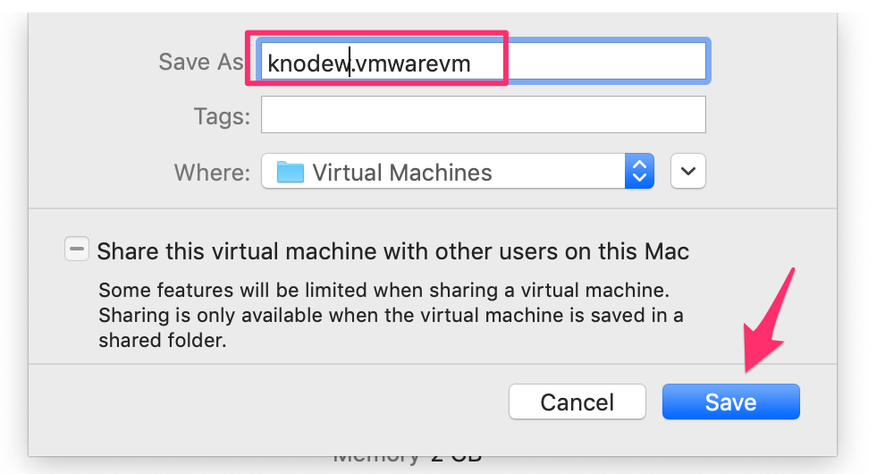
     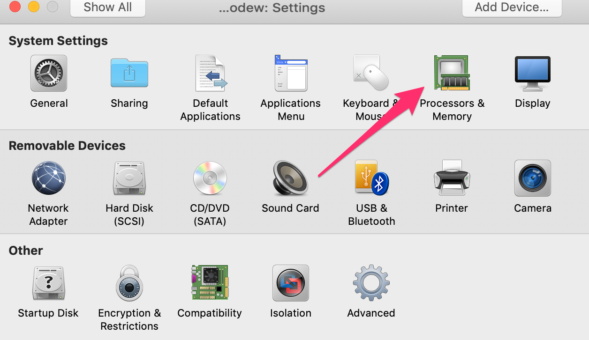
     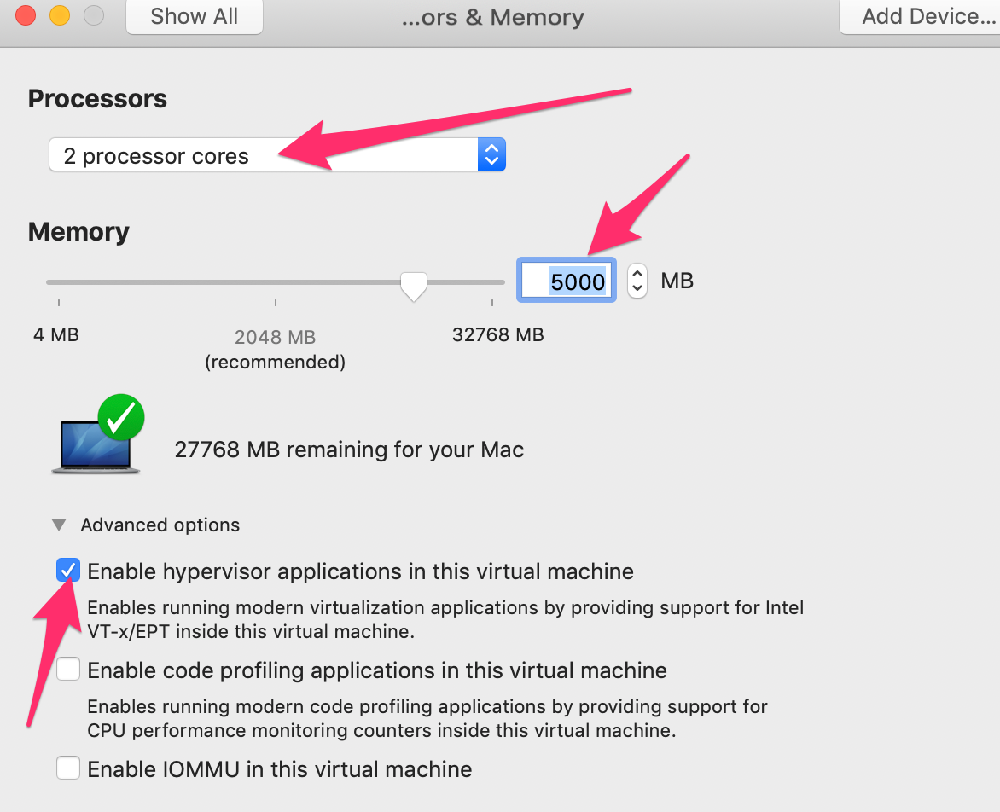
     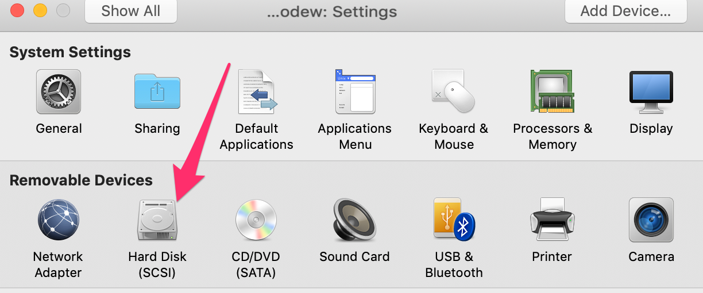
     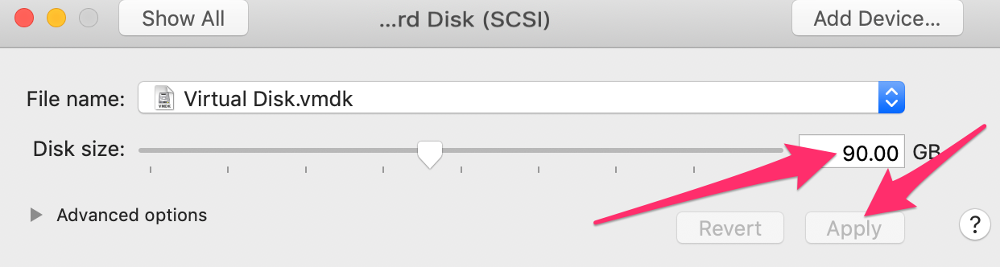
     
     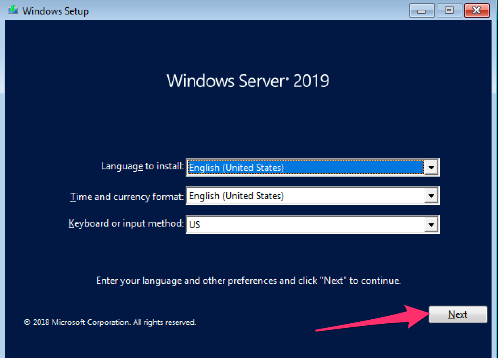
     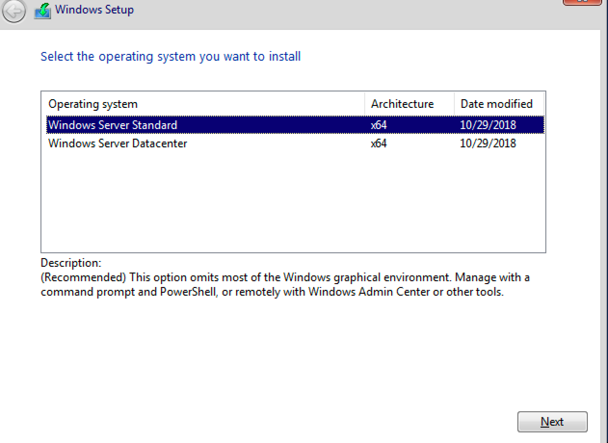
     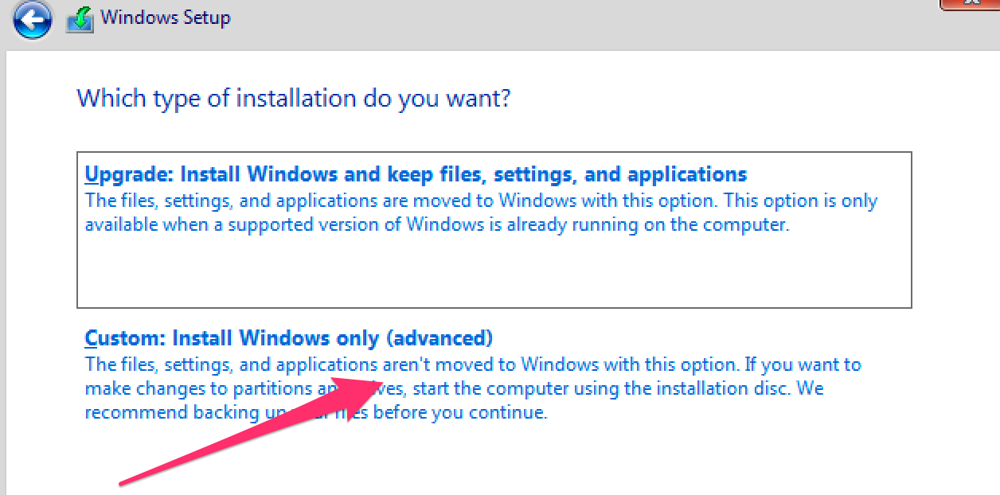
     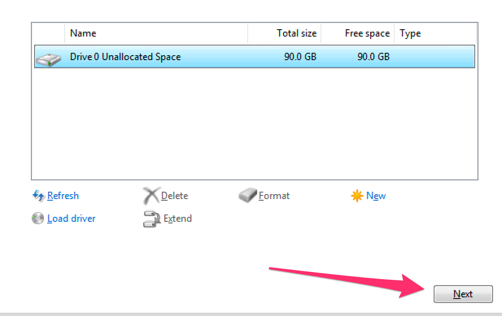

- Install VMWare Tools

     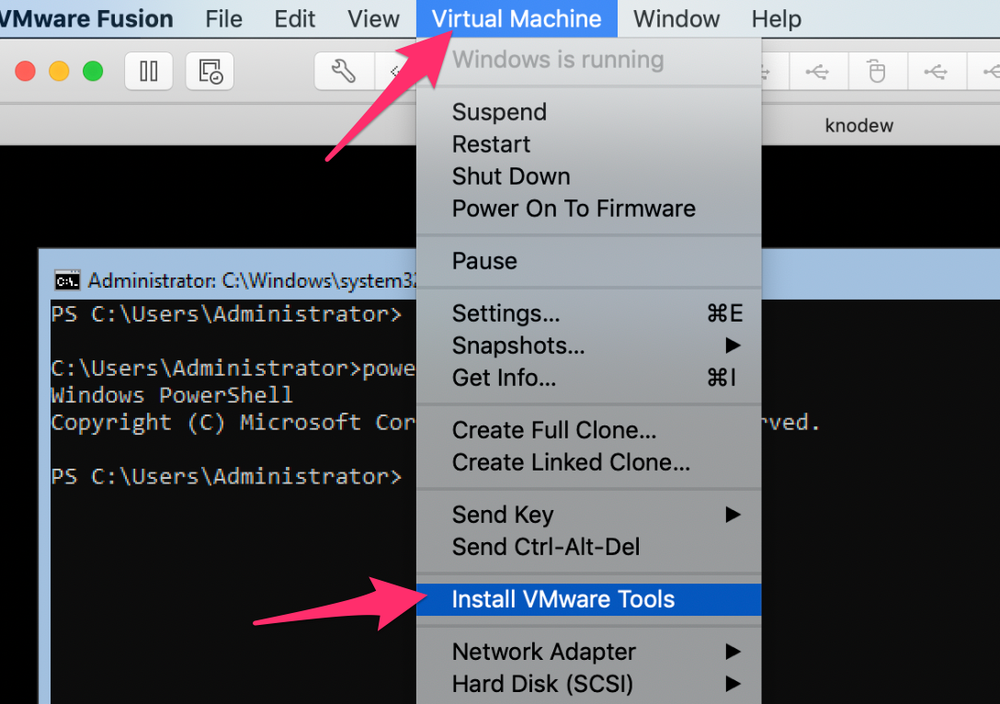

- Change to the `d:\` directory and retun the **setup.exe** file

     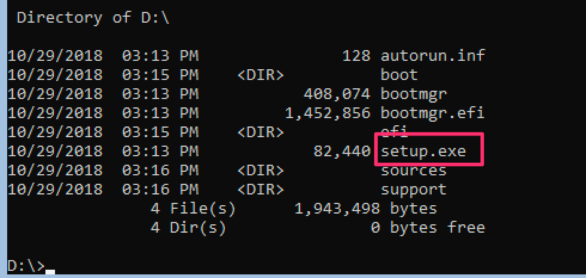
     

### **Step 3**: Configure Windows Image

- From the Administrative Console, enter powershell, disable the firewall and Disable IPV6 on all network interfaces - Note: Most of the following is found in the [Microsoft Documentation](https://docs.microsoft.com/en-us/virtualization/windowscontainers/kubernetes/joining-windows-workers) for Kubernetes

    ```
    powershell

    Set-NetFirewallProfile -Profile Domain,Public,Private -Enabled False

    New-ItemProperty “HKLM:\SYSTEM\CurrentControlSet\Services\Tcpip6\Parameters\” -Name “DisabledComponents” -Value 0x000000ff -PropertyType “DWord"

    ```

- Optionally, install Container Support

    ```
    Install-WindowsFeature -Name Containers
    ```

     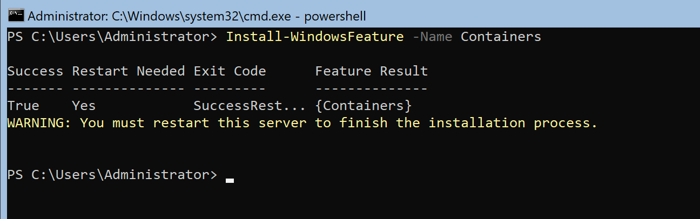

### **Step 4**: Enable Remote Desktop and a Shared Drive

- **Exit Powershell**, then Enable Remote Desktop

    ```
    Cscript %windir%\system32\SCRegEdit.wsf /ar 0
    ```

- Create a Network Share Drive. This share will be useful if you need to copy files to the Windows Image - for example; when we soon copy the kube exe files.

    ```
    net share Utils=c:\k /Grant:administrators,FULL
    ```

- Enter Powershell

    ```
    powershell
    ```
### **Step 5**: Install Docker

- Install Docker Module - Anser yes when prompted

    ```
    Install-Module -Name DockerMsftProvider -Repository PSGallery -Force
    ```

- Install Docker Package

    ```
    Install-Package -Name Docker -ProviderName DockerMsftProvider
    ```
- Set the Hostname of the windows Image

    ```
    Rename-computer knodew
    ```

- Restart the image

    ```
    Restart-Computer -Force

    ```

- Once reloaded, enter Powershell, and check on the docker version

    ```
    powershell

    docker version
    ```

- If an error is displayed as show below, then start the docker service:

     

    ```
    Start-Service docker
    ```

### **Step 6**: Configure required docker images

- Pull the docker image for Windows Server 1809

    ```
    docker pull mcr.microsoft.com/windows/nanoserver:1809
    ```

- Tag the image. 

    ```
    docker tag mcr.microsoft.com/windows/nanoserver:1809 microsoft/nanoserver:latest
    ```

- Test the Docker Image, then `exit` the container after it succesfully loads

    ```
    docker run -it --rm microsoft/nanoserver:latest
    ```

### **Step 7**: Get the required Kubernetes Software Configured

- Make a c:\k directory

    ```
    mkdir c:\k
    ```

- Change to the `K` directory

    ```
    cd c:\k
    ```

- Copy the **config** file from the master node... e.g. 

    ```
    scp kubeuser@kmaster:.kube/config .
    ```

- Download the [Kubenetes Node executables for Windows - 64 bit](https://github.com/kubernetes/kubernetes/blob/master/CHANGELOG-1.12.md#node-binaries) and place `'kubeadm.exe`, `kubectl.exe`, `kubelet.exe` and, `kube-proxy.exe` binaries on the `c:/K` drive

- Add `K` to the path and make it permanent

    ```
    $env:Path += ";C:\k"

    [Environment]::SetEnvironmentVariable("Path", $env:Path + ";C:\k", [EnvironmentVariableTarget]::Machine)

    ```

- Set the KubeConfig env variable and make it permanent

    ```
    $env:KUBECONFIG="C:\k\config"

    [Environment]::SetEnvironmentVariable("KUBECONFIG", "C:\k\config", [EnvironmentVariableTarget]::User)

    ```

- See if the Node executables and config file are working

    ```
    kubectl config view

    kubectl get nodes
    ```

- Download the Flannel software

    ```
    [Net.ServicePointManager]::SecurityProtocol = [Net.SecurityProtocolType]::Tls12

    wget https://github.com/Microsoft/SDN/archive/master.zip -o master.zip

    Expand-Archive master.zip -DestinationPath master

    mv master/SDN-master/Kubernetes/flannel/l2bridge/* C:/k/

    rm -recurse -force master,master.zip
    ```

### **Step 8**: Join knode **(Windows)** to kmaster

- Join the Master

    ```
    cd c:\k

    chcp 65001

    .\start.ps1 -ManagementIP <Windows Node IP> -ClusterCIDR 10.244.0.0/16 -ServiceCIDR 10.96.0.0/12 -KubeDnsServiceIP 10.96.0.10
    ```
- Create a windows namespace. We will always install Windows pods using this namespace, as the default namespace will be configured to automatically install the istio side car container. This would cause and error on the Windows ndoes, as side cars are not yet supported.

    ```
    kubectl create namespace windows
    ```

- **Taint** the winodws node, to control what is deployed to it. We will set the Windows Pod deployments to **Tolerate** the windows Taint.

    ```
    kubectl taint nodes knodew opsys-taint=windows:NoSchedule
    ```

- Get information about the Node, and you'll see the **Taint**

    ```
    kubectl describe node knodew
    ```

### **Step 9**: Test a sample Windows Image

- Pull the following image down to the Windows node, as it will be used shortly

    ```
    docker pull mcr.microsoft.com/windows/servercore/iis:windowsservercore-ltsc2019
    ```

- Run notepad to create a new file

    ```
    notepad iis-win.yml
    ```

- Enter the following text into the file, and save the file

    ```
    apiVersion: apps/v1
    kind: Deployment
    metadata:
    name: iis-deploy
    namespace: windows
    spec:
    replicas: 1
    selector:
        matchLabels:
        app: iis
    template:
        metadata:
        labels:
            app: iis
        spec:
        containers:
        - name: iis
            image: mcr.microsoft.com/windows/servercore/iis:windowsservercore-ltsc2019
            resources:
            limits:
                memory: "128Mi"
                cpu: 2
            ports:
            - containerPort: 80
        nodeSelector:
            beta.kubernetes.io/os: windows
        tolerations:
        - key: "opsys-taint"
            operator: Equal
            value: "windows"
    ---
    apiVersion: v1
    kind: Service
    metadata:
    labels:
        app: iis
    name: iis-svc
    namespace: windows
    spec:
    type: NodePort
    ports:
        - port: 80
    selector:
        app: iis
    ```

- Apply the file to cause it to be loaded into the cluster

    ```
    kubectl apply -f iis-win.yml
    ```

- Run the following command to monitor the pod loading. Note, it may take time as the images is quite large, and needs to be downloaded

    ```
    kubectl get pods -o wide -n=windows
    ```

- You can also look at docker to see the image

    ```
    docker images

    docker ps
    ```

### Notes on how to get the information about the Cluster IP and DNS

- Get Service Subnet/CIDR:

    ```
    kubectl cluster-info dump | grep -i service-cluster-ip-range
    ```

- Get Kube DNS

    ```
    kubectl get svc/kube-dns -n kube-system
    ```

- Continue with the [Istio.md](./KubeNetConfig.md) documentation.

