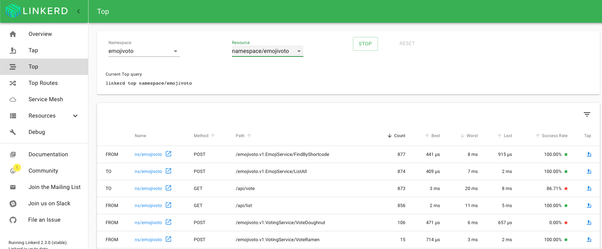
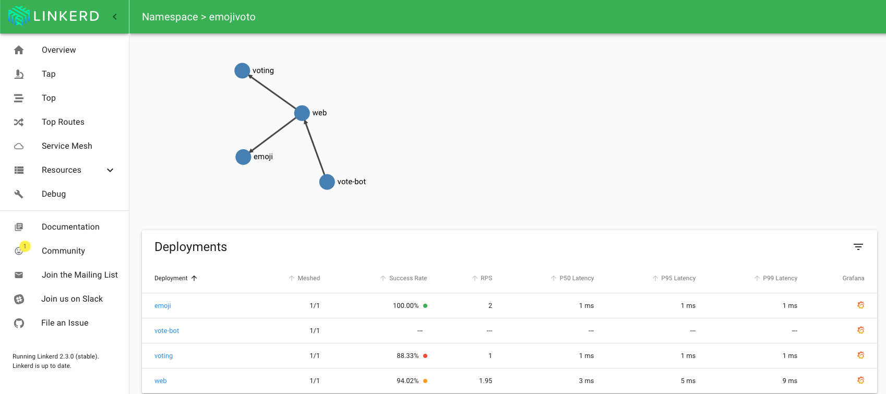

# Linkerd

## Installing Linkerd

### **STEP 1**: Install Linkerd CLI

- Instructions found in [official docs](https://linkerd.io/2/getting-started/)

- On **kmaster** image, install Linkerd CLI

  `curl -sL https://run.linkerd.io/install | sh`

- Add linkerd CLI to your PATH:

  `export PATH=$PATH:$HOME/.linkerd2/bin`

### **STEP 2**: Install Linkerd

- Run installation pre-check:

  `linkerd check --pre`

- Install in the cluster:

  `linkerd install | kubectl apply -f -`

- Validate a successful installation with:

  `linkerd check`

### **STEP 3**: Start Linkerd dashboard

- Launch the dashboard with

  `linkerd dashboard &`

### **STEP 4**: Install Sample App

- Linkerd provides a sample web app with a traffic generator to showcase tracing and debugging features. Install the sample:

  `curl -sL https://run.linkerd.io/emojivoto.yml | kubectl apply -f -`

- Port forward 8080 to the app:

  `kubectl -n emojivoto port-forward svc/web-svc 8080:80`

- Manually inject the linkerd proxy sidecar into the app's pods:

  `kubectl get -n emojivoto deploy -o yaml | linkerd inject - | kubectl apply -f -`

- Automatic proxy injection is also supported: [documentation](https://linkerd.io/2/tasks/automating-injection/)

- In the dashboard navigation pane, click **Top**, then select the **emojivoto** namespace and click **Start**:

  

- The dashboard shows the traffic being generated by the vote-bot. For each REST endpoint, the best, worst, and last latency is shown, along with the success rate of requests based on HTTP error codes

- Click the **Service Mesh** menu option, then click the **emojivoto** namespace.

  

- A visualization of the app's traffic flow is generated, along with the P50, P95, and P99 latency of each deployment and pod.
